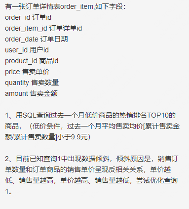

# 1面(1h30min)

### 闲聊

1.职业方向

2.“工”字形职业路径

### 大数据

1.MR过程

2.Spark 3种 join，适用场景

3.Spark 出现 OOM 的问题，如何定位问题，有什么方法可以解决问题。

### 数仓

1.如何理解数据仓库的作用

2.数仓建模（维度建模、DV建模）

3.维度表和事实表如何判断，规则。（现实存在的对象，不常改变的属性作为维度表，分析度量，业务过程作为事实表）

4.退化维、维度退化

### 算法

1.搜索旋转数组

2.

数据倾斜解决方案：1.不了解业务逻辑的情况下，将查询分为多P。2.了解业务逻辑的情况下，进行二次聚合（group by order_date) 打散导致倾斜的 key