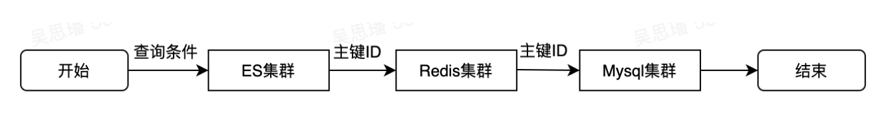
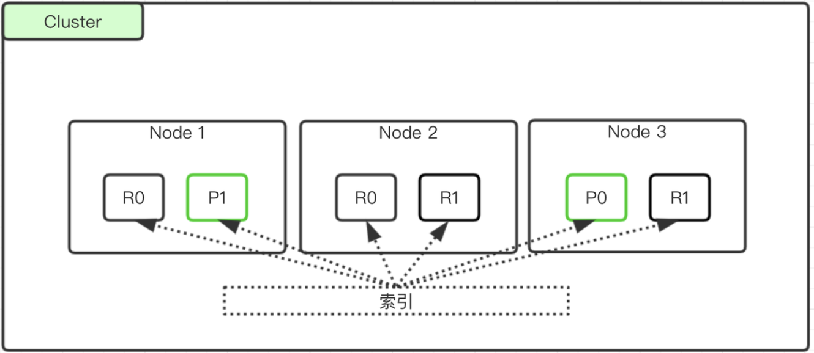
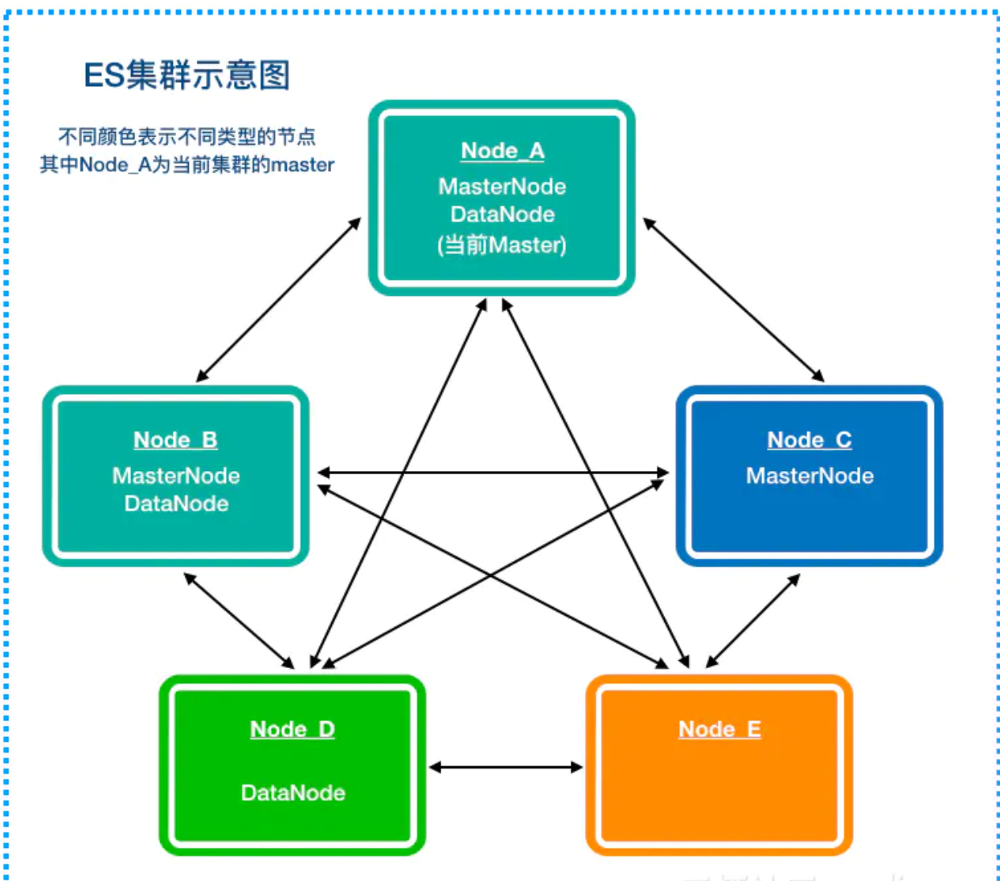
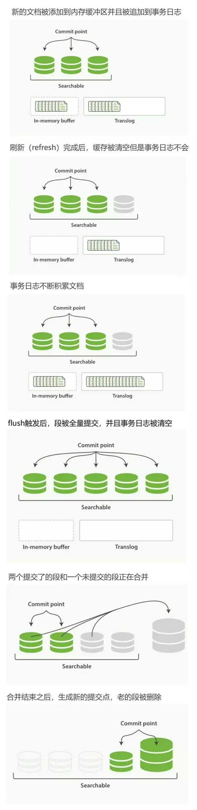

## 简介

Elasticsearch（简称ES）是一个分布式、可扩展、实时的搜索与数据分析引擎。底层以来 Lucene，使用 Lucene 做索引与搜索，对外提供 RESTful API。大多数的场景下，查询服务的顺序可概括为：



对于模糊查询和全文查询等复杂的查询，Redis 不好创建 key，MySQL 也利用不到索引，因此先通过 ES 查询到主键 ID ，然后走缓存和数据库可以确保数据的一致性和查询速度。

- 与 Mysql 相比，ES对模糊查询有着更好的支持，并且利用缓存为反复出现的查询命令提供加速，提高查询速度。

- 与 Redis 相比，ES在查询方面提供复杂的组合查询语句，在存储方面不会将全部数据写入内存，可以支撑数据规模较大的场景。
- 但是 ES 再创建字段时要预先建立 Mapping，字段类型设置后便无法修改，**不够灵活**。同时写入数据时会自动**创建大量索引**，写入性能相对较低，并且会占用大量存储空间。


ES 的特点：

- 分布式的实时文档存储引擎，每个字段都可以被索引和搜索
- 分布式实时分析搜索引擎，支持各种查询和聚合操作
- 能扩展到上百个服务节点，支持 PB 级别的结构化和非结构化数据


## 基本概念

### 文档结构概念

- Index：可以理解为 MySQL 中的 database
- Mapping：表定义，json
- Documnet：表中的一个文档，MySQL 中一行数据
- Field：字段，MySQL 中的lie

```json
PUT /megacorp/employee/1
{
    "first_name" : "John",
    "last_name" :  "Smith",
    "age" :        25,
    "about" :      "I love to go rock climbing",
    "interests": [ "sports", "music" ]
}
```

### 架构概念

- Node：实例节点
  - Master：管理集群范围内的所有变更，如索引增加、删除，节点增加和删除。保存和更新集群的元数据信息。
  - Data
  - Coordinate
- Shard：ES 将数据存储在多个物理 Lucene 引擎上，这些数据就是分片
  - 主分片
  - 副本
- Segment：本质上就是分片中的一个倒排索引。每秒生成一个 segment，segment 过多时出发合并，并将 segment 标记删除的文档真正删除。
- File
- Commit point：每个 Segment 中都会有一个提交点，保存了当前分片中已经成功落盘的所有 Segment，同时维护一个 .del 文件用来记录被声明删除的文档


## 架构

一个索引有多个分片，可以存储在多个节点上。



ES 中所有节点都是对等的。每个节点都能收到请求并路由到存储相关分片的其他节点上。接收请求的节点负责收集其他节点的查询结果最后返回 Client。




### 选举

选举策略为：如果有 Master 则认可该 Master，否则从候选 Master 中选取 id 最小的作为 Master。

选举的时机：

- 启动集群时，守护进程 ping 集群中的节点，使用上述策略选 Master
- Master 挂掉时，后台定时 ping Master，发现挂掉重新选举

选举流程：

- 节点 A 通过多播（默认）或单播 ping 全部节点，如果得到 response 报文内含有响应节点的基本信息和其选举的 Master。当半数以上节点认可一个 Master 时，向该节点发送 join 请求加入集群。当 A 收到 Master 发布的 cluster_state 时表明自己已经加入集群。
- 若不足半数则需要选举：
  1. A 将一直所有节点按照 clusterStateVersion 降序 UID 升序的顺序取第一个节点 B 为自己选举的 Master，向其发送 join 请求并等待一段时间
     - 若收到 B 发布的 cluster_state，则 B 为新 Master
     - 超时或 B 拒绝，开启下一轮选举。
  2. A 选自己当 Master， 等待其他节点 join 自己，当收到半数以上的请求后， 修改 cluster_state 中 master node 为自己，向集群发布消息
- 集群分裂成长时间无法联通的两部分，Master 选举会一直失败，此时 ES 集群挂掉。


### 容错机制

如果有 9 个 shard，三个 ES 节点，此时master 节点挂掉，存在 primary shard 都是活跃状态，因此集群状态为 red

1. 选举一台新的 Master
2. 新 Master 把挂掉的 primary shard 的副本提升为 primary。此时集群状态为 yellow，因为缺少了一个正常的副本。
3. 重启故障节点，新 Master 将所有副本都复制一份到该节点（同步不可用期间的修改）。此时所有 primary shard 和 relica shard 都是活跃状态，集群状态变为 green。


## ES 操作过程

### ES 写入



##### 

- translog：写入 ES 的数据首先会被写入 translog，该文件持久化到磁盘，保证服务器宕机时数据也不会丢失，顺序写磁盘速度也很快。
  - 同步：每次写入请求执行时，translog 在 fsync 到磁盘后才会返回客户端 200
  - 异步：translog 每隔固定时间后才会 fsync 到磁盘，写入量很大，有可能会丢失数据

- refresh：内存的 buffer 中的文档是无法立即被查询的，refresh 会将这些新写入的数据生成一个新的 Segment 并清空 buffer，默认每1秒刷新一次。新的 Segment 并未落盘

- commit/flush：超过固定时间或 translog 过大时，触发 flush 操作：

  - 内存的 buffer 被清空，相当于进行一次 refresh
  - 内存中的 Segment 刷写至磁盘
  - 将包含所有 Segment 的提交点写入磁盘
  - translog fsnyc 到磁盘中
  - translog 清空

- merge：每次 refresh 时都会在文件系统缓冲区中生成一个 Segment，随着 Segment 数量越多会进行 merge

  - 磁盘上两个小segment：A和B，内存中又生成了一个小segment：C

  - A,B被读取到内存中，与内存中的C进行merge，生成了新的更大的segment：D

  - 触发 commit 操作，D被 fsync 到磁盘

  - 创建新的提交点，删除A和B，新增D

  - 删除磁盘中的A和B


### ES 删改

由于 Segment 不可变，因此

- Segment 的读写无需加锁
- 常驻文件系统缓存 （对外内存）
- 查询的 filter 缓存常驻内存

#### 删除

每个 Segment 都有一个 .del 与之关联。当删除文档时，在.del 中标记为删除。文档仍能搜到但是会被过滤。在 Merge 时不会处理被标记删除的文档。

#### 更新

版本号机制。每个文档更新后都会产生一个新的版本号，旧版本的文档在 .del 中标记删除。

### ES 查询

默认策略 query then fetch

1. 向所有的 Shard 发出请求，各分片只返回 Top size 个文档 id 和分值，然后放进优先队列里取前 size 个文档
2. 根据文档 id 获取文档。

- 返回数据量准确
- 性能一般

