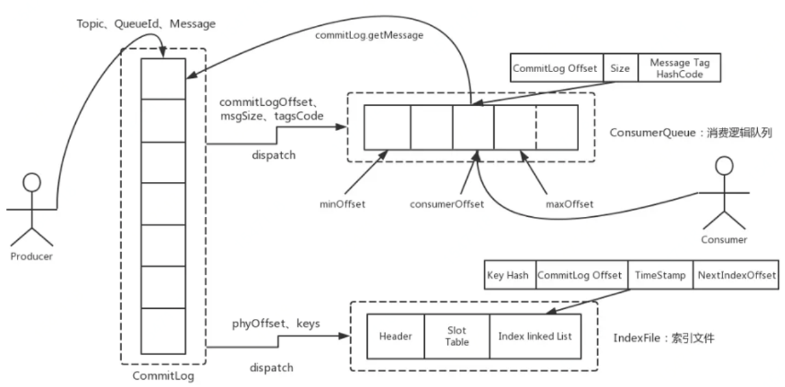

## 消息队列

可以应用在

- 解耦
- 削峰填谷
- 异步

消息队列对比

| 性能                    | ActiveMQ                                 | RabbitMQ                                                     | RocketMQ                                                     | Kafka                                         |
| ----------------------- | ---------------------------------------- | ------------------------------------------------------------ | ------------------------------------------------------------ | --------------------------------------------- |
| 单机吞吐量              | 万级                                     | 万级                                                         | 十万级                                                       | 十万级                                        |
| Topic数量对吞吐量的影响 | -                                        | -                                                            | Topic可以达到几百、几千个的级别，吞吐量会有小幅下降          | Topic从几十个到几百个的时候，吞吐量会大幅下降 |
| 时效性                  | ms级                                     | µs级                                                         | ms级                                                         | ms级以内                                      |
| 可用性                  | 高，主从架构                             | 高，主从架构                                                 | 非常高，分布式架构                                           | 非常高，分布式架构                            |
| 消息可靠性              | 有较低的概率丢失数据                     | -                                                            | 经过参数配置，可以做到零丢失                                 | 经过参数配置，可以做到零丢失                  |
| 负载均衡                | 支持                                     | 不支持                                                       | 支持                                                         | 支持                                          |
| 优势                    | 非常成熟，功能强大，文档丰富，支持多语言 | erlang语言开发，延时很低，管理界面友好，支持多语言，社区活跃 | 接口简单易用，分布式扩展方便，社区活跃，支持大规模的Topic，支持多种消费方式 | 极高的可用性和可靠性，分布式扩展方便          |
| 劣势                    | 偶尔有较低概率丢失消息，社区活跃度不高   | erlang语言开发不容易进行定制开发，集群动态扩展麻烦           | 只支持Java，接口不是按照标准JMS规范走的，有的系统迁移要修改大量的代码 | 大量topic下吞吐量降低                         |

## 基本概念

- Producer：发消息
- Consumer：消费消息
- Consumer Group：订阅了相同 Topic 的多个 Consumer 实例组成的一个消费组
- Topic：消息的逻辑分类，可以理解为消息的类别
- Message：消息本体，必须指定一个 Topic
- Name Server：提供路由
- **Broker**：接收生产者的消息，存储消息以及为消费者拉取消息做好准备。Broker 分为 Master 和 Slave。
- Queue：Topic 在 Broker 的分片等分为指定份数后的其中一份，负载均衡过程中资源的基本单位。

## 组件

### NameServer

作为注册中心为 Producer 和 Consumer 提供路由，并与 Broker 保持心跳。类似 ZK （早期 RockerMQ 使用 ZK），区别在于 NameServer 个节点独立，没有选主和主从切换的问题，更轻量级。

NameServer 存储所有 Broker 列表并保持长链接心跳。

主要功能在于：

#### 注册发现

针对 Broker，Broker 在启动时会和所有 NameServer 节点建立长链接，每隔30s发送一次心跳，包含 BrokerId、地址、名称的信息。NameServer 收到心跳后存储到 RouteInfoManager 对象。

RouteInfoManager 有四个 Map

- clusterAddrTable
- brokerLiveTable
- brokerAddrTable
- topicQueueTable

NameServer 处理心跳包时，存在多个 Broker 修改一张 Broker 表，为了避免并发修改问题，引入了 ReadWriteLock。

NameServer 在注册路由和剔除路由时，并不会主动推送客户端，需要客户端定时拉取 Topic 最新的路由。客户端拉取请求过来后，NameServer 会更新 topicQueueTable，brokerAddrTable，clusterAddrTable。

#### 路由剔除

两个触发点：

- 定时任务每10s扫描一下 brokerLiveTable，如果某个 Broker 心跳包最新时间戳距离当前时间超过120s，则判定该 Broker 失效并移除。
- Broker 关闭，断开长链接，Netty 监听器会监听到连接断开事件，然后剔除。

路由剔除后，需要更新 topicQueueTable，brokerAddrTable，clusterAddrTable

### Producer

- 与一台 NameServer 保持长连接，定时（默认30s）查询 Topic 配置iximxi，如果该 NameServer 挂点，自动连接下一个 NameServer
- 与所有关联的 Broker 保持长连接，每隔向所有 Broker 发送心跳。

#### 消息类型

- 普通消息
- 延迟消息：延迟消息在投递时需要设置为指定的延时级别。
- 顺序消息：对于一个指定的 Topic，Producer 保证消息顺序的发到一个队列中，消费的时候要保证队列只有一个现线程消费。
- 事务消息：通过两阶段提交、状态定时回查来保证消息一定发到 Broker。

#### 发送方式

- 可靠同步发送：接受方回应后才会发送下一个数据包
- 可靠异步发送：需要用户实现异步发送回调接口。发送方通过回调接口接收响应
- 单向（Oneway）发送：只负责发送消息。耗时较短，一般在微秒级别。

#### 发送流程

1. Producer 发送时若本地路由表中未缓存 Topic 的路由信息，则向 NameServer 请求路由，更新本地路由表，并每隔30s从 NameServer 更新本地路由表。
2. 轮询 Topic 下所有 QueueData，根据 BrokerName 找到 BrokerData 信息，完成路由查询。
3. 消息发送。将消息发送到指定 Broker 节点上。

### Consumer

RocketMQ 是基于发布订阅模型的消息中间件，两种消费模式

- BROADCASTING 广播模式：一条消息能被多个 Consumer 消费，即使这些 Consumer 属于同一个 ConsumerGroup。
- CLUSTERING 集群模式（默认）：一条消息只能被 ConsumerGroup 中的一个 Consumer 消费。

|             | 连接                           | 轮询时间 | 心跳                                                         |
| ----------- | ------------------------------ | -------- | ------------------------------------------------------------ |
| NamerServer | 与 Producer 连接方式类似       | 30s      | 无                                                           |
| Broker      | 与所有关联的 Broker 保持长连接 | 无       | 每隔30s向所有 Broker 发送心跳，一旦断开 Broker 立刻感知，并通知消费组中的 Consumer 重新分配队列继续消费 |

#### 拉取流程

消息中间件一般有两种消费方式

- Push：由消息中间件推送消息给消费者；实时性高，可以尽快推送消息，但是当消费者消费能力较弱时，可能会导致消费者缓冲区溢出。
- Pull：消费者客户端主动拉取消息；可控性好，拉取频率需要一定策略。如果每次拉取时间间隔较长，会增加消息的延迟，若太短，可能多次拉取都没有消息可以消费，产生了大量无效的 Pull 请求，降低 MQ 网络性能。

RocketMQ 基于 Pull 消费，还采用了一种长轮询机制来平衡上述优缺点。

pullMessageService 类中将新加入的 messageQueue 拉取任务加入到 pullRequestQueue 阻塞队列当中。

pullMessageService 在拉取消息之后，并不参与消费。拉取流程中回调用 pullAPIWrapper.**pullKernelImpl**，其核心参数有

- mq：要拉取的消息队列
- offset：拉取偏移量
- maxNums：拉取最大条数，默认32
- brokerSuspendMaxTimeMillis：允许 Broker 挂起的时间，默认15s
- timoutMills：拉取的超时时间
- communicationMode： 拉取模式，默认异步
- pullCallBack：拉取到消息后的回调

Broker 返回的数据：

- pullStatus：拉取结果
- nextBeginOffset：下次拉取偏移量
- minOffset：消息队列最小偏移量
- maxOffset：最大偏移量
- msgFoundList：消息列表

**长轮询**机制：Consumer 发送 pull 请求，Broker 如果发现队列中没有新消息不立即返回，而是持有请求一段时间（超时时间）。若这段时间内有新消息，就用现有连接返回给消费者，否则返回为空。避免了 Pull 模式下无效请求。

#### 消息负载

rebalanceService 线程实现消息负载，每隔20s进行一次负载均衡

1. 从缓存中获取 Topic 对应的消息队列 mqSet 和所有消费者 cidAll
2. 按照负载均衡策略分配消息队列
   - 平均算法
   - 环形平均算法
   - 根据配置负载均衡算法，根据配置，为每一个消费者配置固定的消息队列
   - 根据机房负载均衡算法
   - 一致性哈希负载均衡算法
3. 和原来旧的队列比较，如果旧的队列被删除，则停止旧队列的消息。如果是新增队列，则创建 PullRequest 扔到阻塞队列中。新创建的 PullRequest 根据 Broker 保存的 offset  开始消费。

Consumer 的数量要不大于 queue 的数量，否则多余的 Consumer 将会没有 queue 可消费。

#### 消息消费

拉取消息时，pullmessage 方法会将从 Broker 拉取的消息存入到 ProcessQueue 对象，提交给消费线程。消费线程会监听业务消费的结果，返回结果给 Broker：

- ConsumeConcurrentlyStatus：消费成功，Broker 更新对应队列的 offset
- RECONSUME_LATER：消费失败，Broker 自动重试，重试次数和重试时间间隔可以在 broker.conf 文件中配置

### Broker

存储 MQ 消息并持久化。

目前业界主流 MQ 采用的存储方式主要有三种：

- 分布式 KV 存储：采用 Redis、RocksDB 等作为消息持久化的方式，由于分布式缓存的读写能力要优于 DB，所以在对消息的读写能力要求都不是比较高的情况下，采用这种方式也不失一种可以替代的设计方案。
- 文件系统：RocketMQ/Kafka/RabbitMQ 都采用的是消息刷盘至文件系统来做持久化。
- 关系型数据库：ActiveMQ可以选用 JDBC 的方式做消息持久化

存储效率来说：FS>KV>RDB，从可靠性来说：RDB>KV>FS

#### 文件结构

- CommitLog：消息存储文件，所有消息主题的消息都存储在 CommitLog中
- ConsumeQueue：消息消费队列文件，消息到达 CommitLog 文件后被异步转发到消息消费队列
- IndexFile：消息索引文件，存储 key 和 offset 对应关系

#### 存储模型

根据类别和作用大致可以将 RocketMQ 的文件存储模型划分为5层

1. 业务处理逻辑层：Broker 端对消息进行读写的业务逻辑入口，主要包含了业务逻辑处理操作，如检查和校验、反序列化、构造 Response 返回对象等。读写操作是通过 DefaultMessageStore 提供的API 完成的。
2. 数据存储组件层：核心类 DefaultMessageStore，业务层可以调用 DefaultMessageStore 的方法完成文件的读写。该组件在初始化时还会启动很多存储相关的后台服务线程。
3. 存储逻辑对象层：与文件存储直接相关的模型类 IndexFile、ConsumeQueue、CommitLog，
4. 文件内存映射层：主要采用 JDK NIO 的 MappedByteBuffer 和 FileChannel 两种方式完成数据文件的读写。MappedByteBuffer 内存映射磁盘的方式完成大文件的读写，RocketMQ 中封装为 MappedFile 类
5. 磁盘存储层：硬件磁盘

#### 存储流程

SendMessageProcessor.asyncSendMessage->

DefaultMessageStore.putMessage->

commitLog.putMessage->

mappedFile.appendMessage

1. Producer 发送消息到 Broker 后，进入 SendMessageProcessor.asyncSendMessage 方法，这个方法进行了一些前置的检查和校验步骤
2. DefaultMessageStore.putMessage 校验和失败监控
3. commitLog.putMessage 调用第四层的 API 完成 CommitLog 的写入
   - 先申请 putMessageLock.lock()锁，因此消息存储到 CommitLog 也是串行的
   - 获取 mappedFileQueue 最后一个 MappedFile，如果为 null 则说明是第一次存储，用偏移量为0创建第一个 CommitLog
   - 调用 mappedFile.appendMessage 将消息追加到 mappedFile，根据返回值构造 putMessageResult。
4. MappedFile 调用 flush 将数据刷写至磁盘。

## 高可用

Broker 分 Master 和 Slave。Broker 的配置文件中 brokerId 值为 0 表示为 Master，大于0为 Slave。

Master 支持读写，Slave 角色只能支持读。

### 消费高可用

Consumer 可以既可以从 Master 订阅消息也可以从 Slave 订阅消息，当 Master 不可用或者繁忙时可以考虑切换至 Slave 拉取消息。

### 发送高可用

Producer 发送消息后没有收到 ACK，失败重试，超时重试

Topic 多副本，存储在多个 Broker 组。当 Producer 第一次发送的 Broker 组中 Master 挂掉，可以重试发送给其他 Broker 组的 Master。

### 存储高可用

#### Master Slave 同步

- 双写同步：Master 接受 Producer 消息后同步给 Slave， 两者都写成功后才会返回 ACK。

  保证 Slave 和 Master 中的消息始终一致，容错高。但是同步复制会增加写入延迟，降低系统吞吐量。

- 异步复制：Master 写成功就返回 ACK，Master 异步复制给 Slave。如果期间 Master 挂掉，会导致部分数据未写入 Slave。

#### 刷写磁盘

- 异步刷盘（ASYNC_FLUSH)：消息写入内存缓存中就可以返回成功，当缓冲区满时溢写磁盘。吞吐量高，但是如果 Broker 挂掉，缓冲区中的消息会丢失。

- 同步刷屏（SYNC_FLUSH)：消息写入磁盘才会返回成功，消息不会丢失，但是系统吞吐量降低。

## 常见问题

### 消息堆积处理

原因：客户端消费能力不足，导致消息堆积。具体又可以分为消费耗时和消费并法度，。

#### 消费耗时

影响消费耗时的逻辑主要是 CPU 计算和 I/O 操作，除非有复杂的递归和循环逻辑，CPU 带来的耗时基本可以忽略，I/O 主要包括

- 读写外表数据库，如 MySQL
- 读写换不缓存，如 Redis
- 下游系统调用，RPC/HTTP

这类外部调用的耗时往往会导致消息堆积。因此解决方法：

- 优化消息消费逻辑中算法复杂度
- 消费消息逻辑中 I/O 操作是否能够避免，引入本地缓存等
- 消费逻辑中耗时操作能否异步处理

#### 消费并发度

| 消息类型       | 消费并发度                           |
| :------------- | :----------------------------------- |
| 普通消息       | 单节点线程数*节点数量                |
| 定时和延时消息 | 单节点线程数*节点数量                |
| 事务消息       | 单节点线程数*节点数量                |
| 顺序消息       | Min单（节点线程数*节点数量，分区数） |

设置合理的消息并发度
