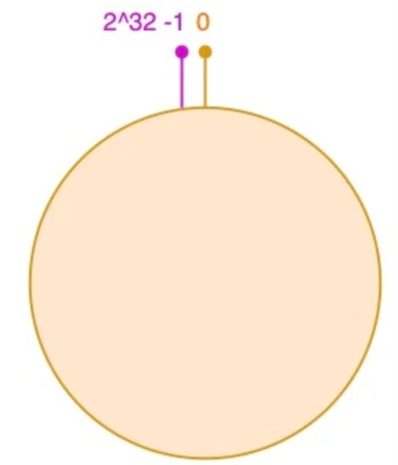
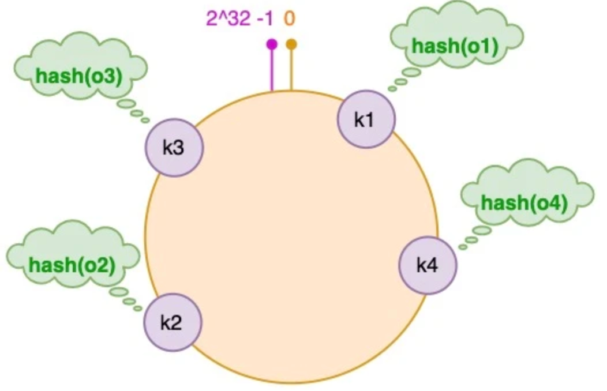
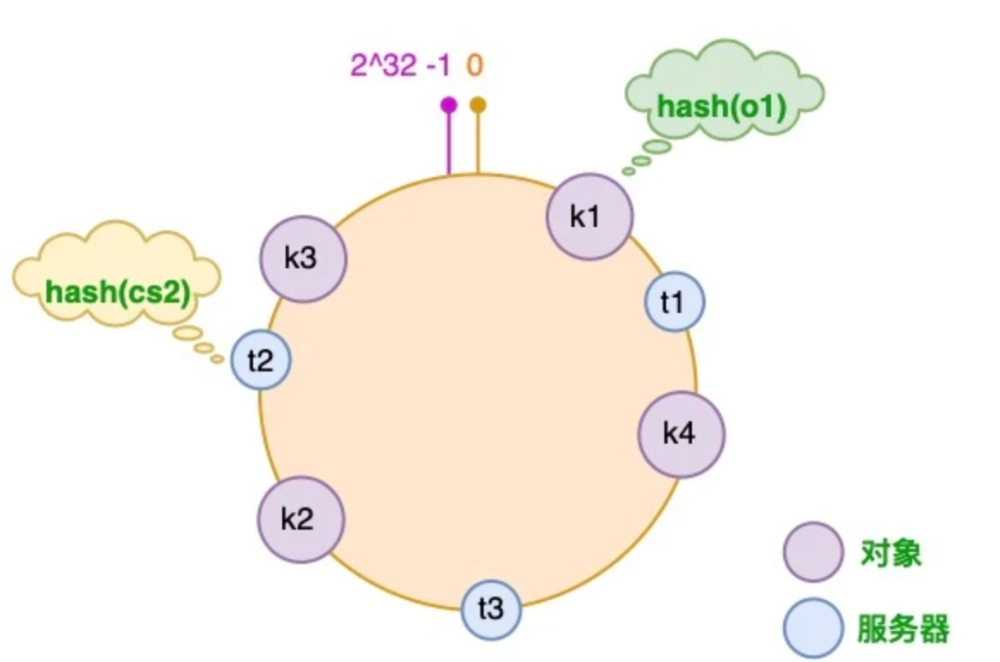
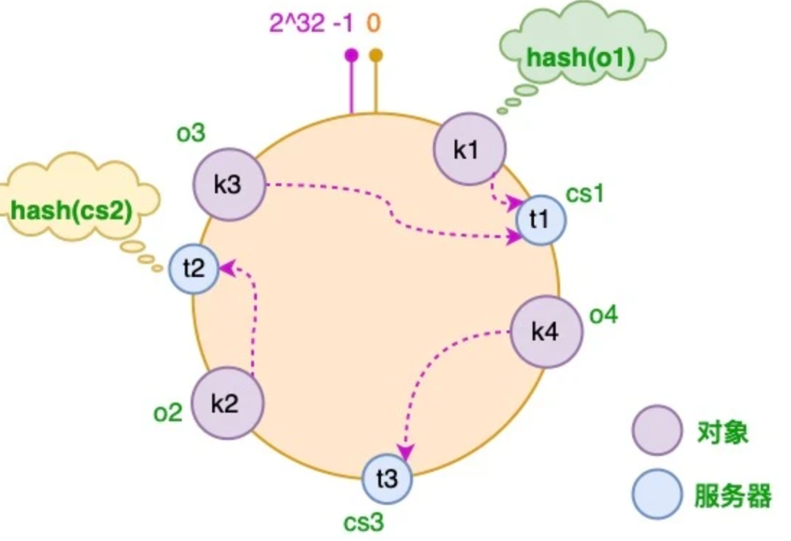
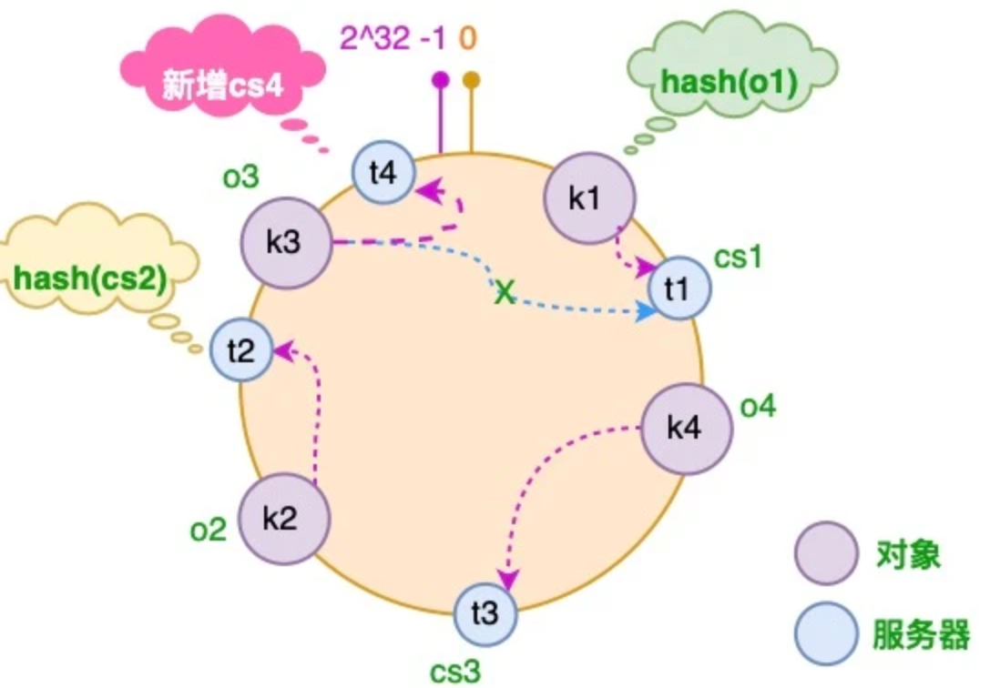
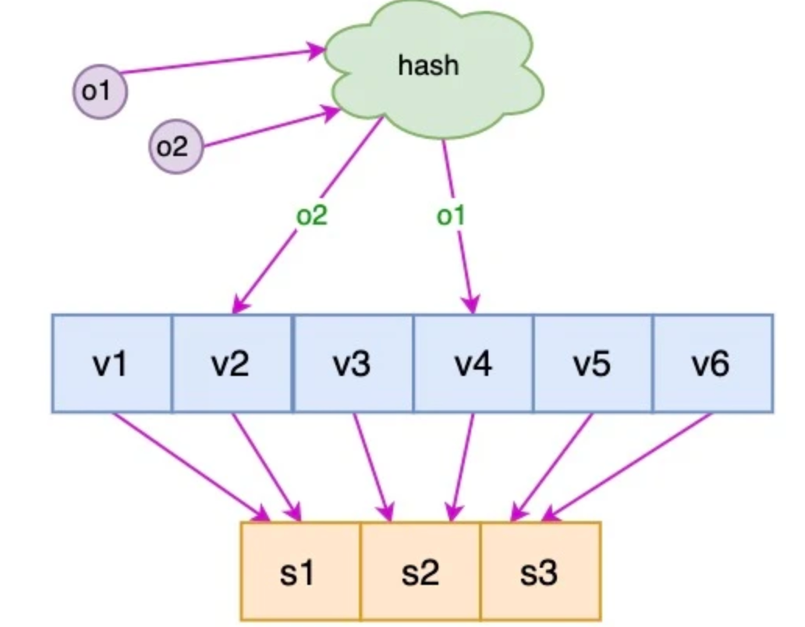
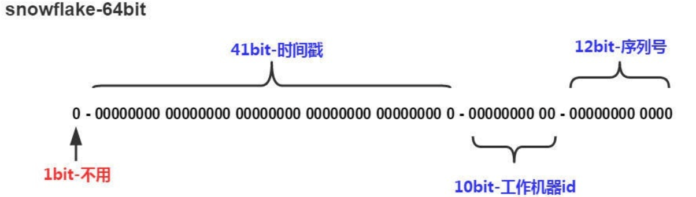

# 分布式系统原理

## 分布式锁

在单机场景下，可以使用语言的内置锁来实现进程同步。但是在分布式场景下，需要同步的进程可能位于不同的节点上，那么就需要使用分布式锁。

阻塞锁通常使用互斥量来实现：

- 互斥量为 0 表示有其它进程在使用锁，此时处于锁定状态；
- 互斥量为 1 表示未锁定状态。

1 和 0 可以用一个整型值表示，也可以用某个数据是否存在表示。

### MySQL 分布式锁

创建一个锁表，资源属性设置为唯一索引。获得锁时向表中插入一条记录，释放锁时可以删除这条记录。


存在以下几个问题：

- 锁没有失效时间，如果节点挂了话其它进程无法再获得该锁。可以通过启动定时任务来检测某个锁是否超时，这样会带来额外繁琐实现成本。
- 只能是非阻塞锁，插入失败直接就报错了。支持阻塞锁的话同样需要额外的实现逻辑。
- 性能局限于数据库，不适合高并发场景。

### Redis 分布式锁

Redis 可以通过 SETNX ( set if not exist ) 指令实现分布式锁。

SETNX 指令和数据库的唯一索引类似，保证了只存在一个 Key 的键值对，那么可以用一个 Key 的键值对是否存在来判断是否存于锁定状态。

通过 EXPIRE 指令对键值对设置过期时间，避免释放锁失败。

#### RedLock 算法

使用了多个 Redis 实例来实现分布式锁，这是为了保证在发生单点故障时仍然可用。

- 尝试从 N 个互相独立 Redis 实例获取锁；
- 计算获取锁消耗的时间，只有时间小于锁的过期时间，并且从大多数（N / 2 + 1）实例上获取了锁，才认为获取锁成功；
- 如果获取锁失败，就到每个实例上释放锁。

小结：

- Redis 实现分布式锁相对简单，性能较好。对于不复杂的要求，可以使用 SETNX，复杂的可以利用 Redission 等客户端。
- 需要维护Redis集群，RedLock 算法还需要维护多个集群。

### ZooKeeper 的有序节点

1.ZooKeeper 抽象模型

ZK 的数据节点类似文件目录，提供了一种树形的命名空间，可以以某个资源名为目录，然后这个目录下面的节点就是我们需要获取锁的客户端，未获取到锁的客户端注册需要注册Watcher到上一个客户端、


2.节点类型

- 永久节点：不会因为会话结束或超市而消失。
- 临时节点：会话结束或超市就会消失。
- 有序节点(EPHEMERAL_SEQUENTIAL)：会在节点名的后面加一个数字后缀，并且是有序的，例如生成的有序节点为 /lock/node-0000000000，它的下一个有序节点则为 /lock/node-0000000001，以此类推。

3.分布式锁实现

- 创建一个锁目录 /lock；
- 当一个客户端需要获取锁时，在 /lock 下创建临时的且有序的子节点；
- 客户端获取 /lock 下的子节点列表，判断自己创建的子节点是否为当前子节点列表中序号最小的子节点，如果是则认为获得锁；否则监听自己的前一个子节点，获得子节点的变更通知后重复此步骤直至获得锁；
- 执行业务代码，完成后，删除对应的子节点。

4.锁超时

如果一个已经获得锁的会话超时了，因为创建的是临时节点，所以该会话对应的临时节点会被删除，其它会话就可以获得锁了。

5.小结

- ZK 不需要关注超时锁如何取消，节点宕机了会删除该节点对应的临时节点。
- 需要额外维护集群。

## 分布式事务

指事务的操作位于不同的节点上，需要保证事务的 ACID 特性。

例如在下单场景下，库存和订单如果不在同一个节点上，就涉及分布式事务。

分布式锁和分布式事务区别：

- 锁问题的关键在于**进程操作的互斥关系**，例如多个进程同时修改账户的余额，如果没有互斥关系则会导致该账户的余额不正确。
- 而事务问题的关键则在于事务涉及的一系列操作需要满足 ACID 特性，例如要满足原子性操作则需要这些操作要么都执行，要么都不执行。

### CAP

分布式系统不可能同时满足一致性( C: Consistency)、可用性（A：Availability）和分区容忍性（P：Partition Torlerance），最多只能同时满足其中两项。


- 一致性

一致性指的是多个节点上的数据副本是否能保持一致的特性，在一致性的条件下，系统在执行数据更新操作之后能够从一致性状态转移到另一个一致性状态。

对系统的一个数据更新成功之后，如果所有用户都能够读取到最新的值，该系统就被认为具有强一致性。

- 可用性

可用性指分布式系统在面对各种异常时可以提供正常服务的能力，可以用系统可用时间占总时间的比值来衡量，4 个 9 的可用性表示系统 99.99% 的时间是可用的。

在可用性条件下，要求系统提供的服务一直处于可用的状态，对于用户的每一个操作请求总是能够在有限的时间内返回结果。

- 分区容忍性

网络分区指分布式系统中的节点被划分为多个区域，每个区域内部可以通信，但是区域之间无法通信。

在分区容忍性条件下，分布式系统在遇到任何网络分区故障的时候，仍然需要能对外提供一致性和可用性的服务，除非是整个网络环境都发生了故障。


在分布式系统中，分区容忍性必不可少，因为需要总是假设网络是不可靠的。因此，CAP 理论实际上是要在可用性和一致性之间做**权衡**。

可用性和一致性往往是冲突的，很难使它们同时满足。在多个节点之间进行数据同步时，

- 为了保证一致性（CP），不能访问未同步完成的节点，也就失去了部分可用性；
- 为了保证可用性（AP），允许读取所有节点的数据，但是数据可能不一致。

### 2PC

两阶段提交（Two-phase Commit，2PC）最终目的在于保证数据的**一致性**，通过引入协调者（Coordinator）来协调参与者的行为，并最终决定这些参与者是否要真正执行事务。

顾名思义，2PC 将一个分布式事务拆分为两个阶段

- **投票**

该阶段的目的在于确认各个参与者是否能够正常执行事务。

1. 协调者向每个参与者发送事务执行请求，并等待参与者反馈事务执行结果。
2. 参与者执行事务但不提交，反馈执行情况给协调者并阻塞等待协调者后续指令。

- **事务提交**

协调者等待反馈有三种可能情况：

1.所有的参与者都能正常执行事务

此时协调者向所以参与者发出提交事务的通知，具体步骤如下：

1. 向每个参与者发出 commit 通知。
2. 参与者收到提交通知后 commit，释放数据库资源。
3. 参与者返回给协调者 commit 结果信息。


2.若干参与者执行失败/ 3.协调者等待超时

此时协调者认为事务执行失败，要求各个参与者回滚，具体步骤如下：

1. 协调者向每个参与者发出 rollback 通知。
2. 参与者收到通知后 rollback，释放数据库资源。
3. 参与者返回给协调者 rollback 结果信息。


1.准备阶段

2PC 解决的是分布式数据库的强一致性问题，协调者和参与者的状态转换如下。


2PC 原理简单，易于实现但是缺点也十分明显：

- 同步阻塞：所有事务参与者在等待其它参与者响应的时候都处于同步阻塞等待状态，无法进行其它操作。
- 单点问题：协调者在 2PC 中起到非常大的作用，发生故障将会造成很大影响。特别是在提交阶段发生故障，所有参与者会一直同步阻塞等待，无法完成其它操作。
- 数据不一致：在提交阶段，如果协调者只发送了部分 Commit 消息，此时网络发生异常，那么只有部分参与者接收到 Commit 消息，也就是说只有部分参与者提交了事务，使得系统数据不一致。
- 容错低：任意一个节点失败就会导致整个事务失败。

对于**同步阻塞**问题，可以引入**超时机制**来改进。协调者在超时时间内没有收到参与者的反馈，则自动退出 WAIT 状态，并向所有参与者发送 rollback 通知。

对于**数据不一致**问题，可以通过**互询机制**改进。参与者处于 READY 并且在指定时间内没有收到第二阶段的通知，则会去询问其他参与者的执行情况：

- 如果另一个参与者执行了 commit/rollback ，则该参与者也执行同样的操作；
- 如果另一个参与者还没到达 READY 状态，则可以推断协调者发出的肯定是 rollback 通知；
- 如果所有的其他参与者都处于 READY 状态，此时 2PC 无法处理，将陷入长时间的阻塞状态。

### 3PC

三阶段提交协议通过引入一个**预询盘**阶段，以及超时策略减少整个集群的阻塞时间，从而提升分布式系统性能。

- 预询盘

协调者会去询问每个参与者是否能够正常执行事务，参与者根据节点情况回复一个预估值，相对于真正执行事务来说该过程是轻量的，具体步骤如下：

1. 协调者向每个参与者都发送事务询问通知，询问是否能执行事务。
2. 参与者根据自身节点情况返回一个预估值，如果预估自己能够执行成功，则返回确认信息，并进入预备状态；否则返回否定信息。

- 预提交

协调者会根据第一阶段参与者返回的信息采取相应操作，预询盘结果主要有三种：

1. 所有参与者返回确认
2. 若干参与者返回否定
3. 协调者超时

针对第一种情况和 2PC 的基本一致，协调者会想所有参与者发送执行事务通知，并等待响应，过程中如果参与者等待超时则中断事务；

对于第二种和第三中情况，协调者任务事物无法执行，则会向各个参与者发出 abort 通知，请求退出预备状态，参与者收到通知后中断事务。


- 事务提交

第三阶段和 2PC 的第二阶段基本一致，不同在于如果出现网络阻塞，参与者迟迟收不到协调者的通知，此时不会像 2PC 那样一直阻塞，而是在等待超时后 commit，仍然可能造成数据不一致。

3PC 协调者和参与者的状态如下。


3PC 在 2PC 的基础上的改进有：

- 在 2PC 的基础上引入了超时机制，能够避免超时间阻塞。
- 在提交阶段如果参与者等待超时，它会去 commit，因为既然已经进入提交阶段，说明在 can_commit 阶段返回了确认信息，它会认为成功提交的几率很大，因此即使没有收到协调者的通知，仍然选择去 commit。

当然 3PC 还是会出现数据一致性的问题。

### 本地消息表

本地消息表与业务数据表处于同一个数据库中，这样就能利用本地事务来保证在对这两个表的操作满足事务特性，并且使用了消息队列来保证最终一致性。

1. 在分布式事务操作的一方完成写业务数据的操作之后向**本地消息表**发送一个消息，本地事务能保证这个消息一定会被写入本地消息表中。
2. 之后将本地消息表中的消息转发到**消息队列**中，如果转发成功则将消息从本地消息表中删除，否则继续重新转发。
3. 在分布式事务操作的另一方从消息队列中读取一个消息，并执行消息中的操作。


## BASE

BASE 是基本可用（Basically Available）、软状态（Soft State）和最终一致性（Eventually Consistent）三个短语的缩写。

BASE 理论是对 CAP 中一致性和可用性权衡的结果，它的核心思想是：即使无法做到强一致性，但每个应用都可以根据自身业务特点，采用适当的方式来使系统达到最终一致性。

### 基本可用

指分布式系统在出现故障的时候，保证核心可用，允许损失部分可用性。

例如，电商在做促销时，为了保证购物系统的稳定性，部分消费者可能会被引导到一个降级的页面。

### 软状态

指允许系统中的数据存在中间状态，并认为该中间状态不会影响系统整体可用性，即允许系统不同节点的数据副本之间进行同步的过程存在时延。

### 最终一致性

最终一致性强调的是系统中所有的数据副本，在经过一段时间的同步后，最终能达到一致的状态。

ACID 要求强一致性，通常运用在传统的数据库系统上。而 BASE 要求最终一致性，通过牺牲强一致性来达到可用性，通常运用在大型分布式系统中。

在实际的分布式场景中，不同业务单元和组件对一致性的要求是不同的，因此 ACID 和 BASE 往往会结合在一起使用。

## 分布式一致性协议

### Paxos

Paxos 算法是基于**消息传递**且具有**高度容错特性**的**一致性算法**，是目前公认的解决**分布式一致性**问题**最有效**的算法之一。用于达成共识性问题，即对多个节点产生的值，该算法能保证只选出唯一一个值。

主要有三类节点：

- 提议者（Proposer）：提议一个值；
- 接受者（Acceptor）：对每个提议进行投票；
- 告知者（Learner）：被告知投票的结果，不参与投票过程。


#### 执行过程

规定一个提议包含两个字段：[n, v]，其中 n 为序号（具有唯一性），v 为提议值。

1. Prepare 阶段

每个 Proposer 都会向所有 Acceptor 发送 Prepare 请求。


当 Acceptor 接收到一个 Prepare 请求，包含的提议为 [n1, v1]，并且之前还未接收过 Prepare 请求，那么发送一个 Prepare 响应，设置当前接收到的提议为 [n1, v1]，并且保证以**后不会再接受序号小于 n1 的提议**。

如下图，Acceptor X 在收到 [n=2, v=8] 的 Prepare 请求时，由于之前没有接收过提议，因此就发送一个 [no previous] 的 Prepare 响应，设置当前接收到的提议为 [n=2, v=8]，并且保证以后不会再接受序号小于 2 的提议。其它的 Acceptor 类似。


如果 Acceptor 接收到一个 Prepare 请求，包含的提议为 [n2, v2]，并且之前已经接收过提议 [n1, v1]。如果 n1 > n2，那么就丢弃该提议请求；否则，发送 Prepare 响应，该 Prepare 响应包含之前已经接收过的提议 [n1, v1]，设置当前接收到的提议为 [n2, v2]，并且保证以后不会再接受序号小于 n2 的提议。

如下图，Acceptor Z 收到 Proposer A 发来的 [n=2, v=8] 的 Prepare 请求，由于之前已经接收过 [n=4, v=5] 的提议，并且 n > 2，因此就抛弃该提议请求；Acceptor X 收到 Proposer B 发来的 [n=4, v=5] 的 Prepare 请求，因为之前接收到的提议为 [n=2, v=8]，并且 2 <= 4，因此就发送 [n=2, v=8] 的 Prepare 响应，设置当前接收到的提议为 [n=4, v=5]，并且保证以后不会再接受序号小于 4 的提议。Acceptor Y 类似。


2. Accept阶段

当一个 Proposer 接收到超过一半 Acceptor 的 Prepare 响应时，就可以发送 Accept 请求。

Proposer A 接收到两个 Prepare 响应之后，就发送 [n=2, v=8] Accept 请求。该 Accept 请求会被所有 Acceptor 丢弃，因为此时所有 Acceptor 都**保证不接受序号小于 4 的提议**。

Proposer B 过后也收到了两个 Prepare 响应，因此也开始发送 Accept 请求。需要注意的是，Accept 请求的 v 需要取它收到的最大 v 值，也就是 8。因此它发送 [n=4, v=8] 的 Accept 请求。


3. Learn 阶段

Acceptor 接收到 Accept 请求时，如果序号大于等于该 Acceptor 承诺的最小序号，那么就发送 Learn 提议给所有 的 Learner。当 Learner 发现有大多数的 Acceptor 接收了某个提议，那么该提议的提议值就被 Paxos 选择出来。


#### 约束条件

1. 正确性

指只有一个提议值会生效。

因为 Paxos 协议要求每个生效的提议被多数 Acceptor 接收，并且 Acceptor 不会接受两个不同的提议，因此可以保证正确性。

2. 可终止性

指最后总会有一个提议生效。

Paxos 协议能够让 Proposer 发送的提议朝着能被大多数 Acceptor 接受的那个提议靠拢，因此能够保证可终止性。

### Raft

Raft 也是分布式一致性协议，主要是用于竞选主节点。

有三种节点：

- Follower
- Candidate
- Leader

#### 单个 Candidate 的竞选

Leader 周期性的发送心跳包给 Follower。每个 Follower 都设置了一个随机的竞选超时时间，一般为 150ms~300ms，如果在这个时间内没有收到 Leader 的心跳包，就会变成 Candidate，进入竞选阶段。

- 下图展示一个分布式系统的最初阶段，此时只有 Follower 没有 Leader。Node A 等待一个随机的竞选超时时间之后，没收到 Leader 发来的心跳包，因此进入竞选阶段。


- 此时 Node A 发送投票请求给其它所有节点。


- 其它节点会对请求进行回复，如果超过一半的节点回复了，那么该 Candidate 就会变成 Leader。


- 之后 Leader 会周期性地发送心跳包给 Follower，Follower 接收到心跳包，会重新开始计时。


#### 多个 Candidate 竞选

- 如果有多个 Follower 成为 Candidate，并且所获得票数相同，那么就需要重新开始投票。例如下图中 Node B 和 Node D 都获得两票，需要重新开始投票。


- 由于每个节点设置的随机竞选超时时间不同，因此下一次再次出现多个 Candidate 并获得同样票数的概率很低。

#### 数据同步

- 来自客户端的修改都会被传入 Leader。注意该修改还未被提交，只是写入日志中。


- Leader 会把修改复制到所有 Follower。


- Leader 会等待大多数的 Follower 也进行了修改，然后才将修改提交。


- 此时 Leader 会通知的所有 Follower 让它们也提交修改，此时所有节点的值达成一致。


### 一致性 hash 算法

#### 传统 hash 算法缺陷

最简单的 hash 算法通过 hash 函数计算出 hash 值后，再对节点数取模操作。

- 对于分布式的场景来说，节点挂掉或者服务扩容和缩容都会使得节点的数量动态变化，此时映射规则大部分会失效。如果各节点提供的服务没有区别，则可能影响不是很大，但是如果是分布式缓存服务，则会导致大量缓存失效。
- 重新计算 hash 值并存储缓存数据代价过大。

#### 一致性 hash 算法

在动态变化的分布式环境中，hash 算法需要满足

- 平衡性：将 hash 后的结果平均分配到每个节点，保证负载均衡
- 单调性：新增/减少节点时不影响系统正常运行
- 分散性：数据应该分散地存储在各个节点中

**原理**：通过一致性 hash 环的数据结构，环形数组，起点为0，终点为 2^32-1。



1. 计算对象的 hash 值并放到环中对应位置。

   

2. 将服务器节点也放置到环中，可以采用节点的 ip 或主机名等进行 hash。

   

3. 此时每个对象应该映射到一个服务器上，映射规则为在环中顺时针距离该对象最近的服务器

   

4. 节点增加，则只需要重新分配从该节点逆时针起离他最近的一个节点之间的数据对象即可

   

   

5. 节点减少也是类似。

#### 虚拟节点

新增节点可能仍然解决不了负载均衡的问题，如 t4 节点增加，只分担了 t1 的流量。

虚拟节点的引入可以解决负载不均衡的问题。将每个节点虚拟为一组虚拟节点，将虚拟节点加到一致性哈希环傻姑上，数据对象先映射到虚拟节点上，在根据虚拟节点和实际节点的对应关系找到实际节点。



#### 

### 分布式 ID

#### 基于 UUID

Java 提供的一个方法，可以生成全球唯一的一个 ID，但是 ID 字符串无实际意义且长度较长，存储性能差。

- 生成简单，本地无网络消耗，具有唯一性
- 无序字符串，不具备自增趋势

#### 基于数据库自增 ID

配置一个单独的 MySQL 实例生成 ID

```mysql
CREATE DATABASE `SEQ_ID`;
CREATE TABLE SEQID.SEQUENCE_ID (
    id bigint(20) unsigned NOT NULL auto_increment, 
    value char(10) NOT NULL default '',
    PRIMARY KEY (id),
) ENGINE=MyISAM;
```

- 实现简单，ID 单调自增
- 单点问题

#### 基于数据库集群模式

解决了单点问题，然而采用多主模型集群引入了新的问题即重复的 ID。

设置不同主节点 ID 的初始值和自增步长。

- 解决了单点问题
- 不利于动态扩容，高并发下数据库压力仍然巨大

####  基于数据库的号段模式

当下分布式ID生成器的主流实现方式之一。从数据库批量地获取自增 ID，每次取出一个号段范围，例如 (1,1000] 代表1000个ID，具体的业务服务将本号段，生成1~1000的自增ID并加载到内存。

```mysql
CREATE TABLE id_generator (
  id int(10) NOT NULL,
  max_id bigint(20) NOT NULL COMMENT '当前最大id',
  step int(20) NOT NULL COMMENT '号段的步长',
  biz_type	int(20) NOT NULL COMMENT '业务类型',
  version int(20) NOT NULL COMMENT '版本号',
  PRIMARY KEY (`id`)
) 
```

biz_type ：代表不同业务类型

max_id ：当前最大的可用id

step ：代表号段的长度

version ：是一个乐观锁，每次都更新version，保证并发时数据的正确性

当这批号段 ID 用完，需要再次向数据库申请新号段

```mysql
update id_generator set max_id = #{max_id+step}, version = version + 1 where version = # {version} and biz_type = XXX
```

- 降低数据库压力
- 具体业务方的需要控制自增逻辑，如果丢该号段的 ID 需要重新获取，有可能导致重复。

#### 基于 Redis 模式

利用 Redis 的 incr 原子命令实现自增ID。

- 原子自增，实现简单
- 单点问题，如果宕机有可能丢失当前ID。

#### Snowflake 算法

由 twitter 开源的分布式 ID 生成算法。生产 Long 类型的ID，64bit：



- 第一个bit位（1bit）：Java中long的最高位是符号位代表正负，正数是0，负数是1，一般生成ID都为正数，所以默认为0。
- 时间戳部分（41bit）：毫秒级的时间，不建议存当前时间戳，而是用（当前时间戳 - 固定开始时间戳）的差值，可以使产生的ID从更小的值开始；41位的时间戳可以使用69年，(1L << 41) / (1000L * 60 * 60 * 24 * 365) = 69年
- 工作机器id（10bit）：也被叫做`workId`，这个可以灵活配置，机房或者机器号组合都可以。
- 序列号部分（12bit），自增值支持同一毫秒内同一个节点可以生成4096个ID

