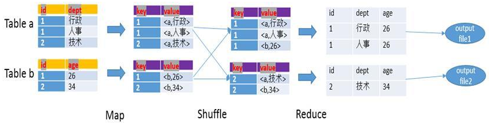
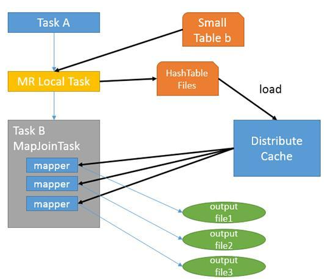
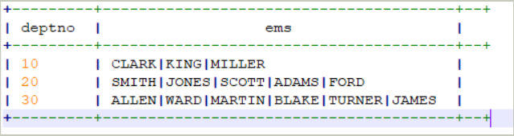
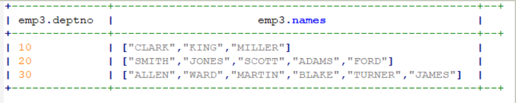
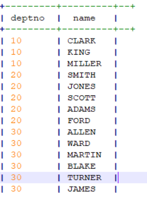

# Hive

## 架构

- MetaStore：存储Hive表和HDFS中文件的映射关系
- Client：接受用户输入以及返回结果
  - CLI（hive shell）
  - JDBC（Java API）
- Driver：用于将 HQL 转换为 MR 程序


## MySQL 与 Hive 的区别

- MySQL 是一个关系型数据库，提供了诸如事务等一系列特性；而 Hive 是一个数据仓库，提供了类 SQL 的查询语言 HQL，能够将查询逻辑转换为 MR 程序从而对底层数据文件进行处理，因此适用于读多写少的分析场景。
- MySQL 不同的存储引擎定义了自己的数据格式；Hive 没有固定的格式，用户可以指定，默认的文件格式有三种：TextFile、Sequence、RCFile。
- MySQL 在数据规模没有超过数据库处理能力时查询延迟较低；Hive 执行延迟高，由于其底层 MR 延迟较高的原因，适用于离线的大数据分析处理。
- MySQL 拥有索引，而Hive 没有索引。

## Hive 的表类型

- 内部表：内部表对应的数据文件存储在 HDFS 中 hive.metastore.warehouse.dir 指定的目录下，删除内部表对应数据文件也会删除。
- 外部表：外部表对应的数据文件存放在 HDFS 中的其他目录下，导入时不会移到指定目录下，同时删除表只会删除元数据而不会删除实际数据文件。
- 分区表：根据数据列将数据文件分为多个区，每个区在该表目录下会创建一个目录，该分区就存储在这个目录
- 分桶表：对指定列计算 hash，根据hash值切分数据，每个桶对应一个文件。

## Hive 数据存储格式

### TextFile

Hive默认格式，数据不做压缩，磁盘开销大，数据解析开销大。
可结合 Gzip、Bzip2、Snappy 等使用（系统自动检查，执行查询时自动解压），但使用这种方式，hive 不会对数据进行切分，从而无法对数据进行并行操作。

### Sequence

SequenceFile 是 Hadoop API 提供的一种二进制文件，将数据以 kv 形式序列化到文件中。

### RCFile

RCFILE 是一种行列存储相结合的存储方式。首先，其将数据按行分块，保证同一个 record 在一个块上，避免读一个记录需要读取多个 block。其次，块数据列式存储，有利于数据压缩和快速的列存取。


## Hive 导出数据

sqoop

## Hive DML中的四个by

- order by：全局排序，只有一个 reducer
- sort by：分区内排序，每个 reducer 内有序
- distribute by：相当于 mr 中的 partition，针对某列进行分区，通常结合 sort by 使用。
- cluster by：当 distribute by 和 sort by 字段相同时，可以使用 cluster by，但是只能升序排序


## Hive join

可以分为 Common join（Reduce 阶段完成 join），Map join（Map 阶段完成join）

### Hive Common Join

默认的 join 方式，在 Reduce 阶段完成 join。

1. Map 阶段：读取原表的数据，Map 输出时候以 join on 条件的列为 key，如果 join 有多个列，则 key 为这些列的组合；value 为 select 的列，同时在 value 中还会包含表的 tag 信息，用于表明 value 对应哪个表。
2. shuffle：根据 key 分区，将数据发送到不同的 reducer 中
3. Reduce：根据 key 的值完成 join 操作，期间通过 tag 识别不同中的数据

例如下面的 SQL

```sql
SELECT a.id, a.dept, b.age
FROM a join b
ON (a.id = b.id)
```



### Hive Map Join

用于小表和大表进行 join 的场景，小表的大小由 hive.mapjoin.smalltable.filesize 来决定，默认为25M。满足时自动转化为 MapJoin。



## Hive 行转列/列转行

行转列指的是多行数据转换为一个列的字段

列转行是某一个字段转换为多行显示

### 行转列

- concat(str1, str2, ...) : 字段或字符串拼接
- concat_ws(sep, str1, str2) : 分隔符 sep 拼接每个字符串
- collect_set(col): 将某列去重汇总为 array 类型 字段

```sql
select deptno,concat_ws("|",collect_set(ename)) as ems from emp group by deptno;
```



### 列转行

- split(str, sep)：将字符串按照后面的分隔符切割，转换成字符array

- explode(col): 将 hive 一列中复杂的 array 或者 map 结构拆分成多行

- lateral view: 

  - **lateral view udtf(expression) tableAlias AS columnAlias**

  - 和 split/explode 等 UDTF 一起使用，能将一行数据拆成多行数据，在此基础上可以对拆分后的数据进行聚合。
  - lateral view首先为原始表的每行调用UDTF，UTDF会把一行拆分成一或者多行，lateral view再把结果组合，产生一个支持别名表的虚拟表。

原数据：



列转行后的数据：

```sql
select deptno,name from emp3 lateral view explode(names) tmp_tbl as name;
```



