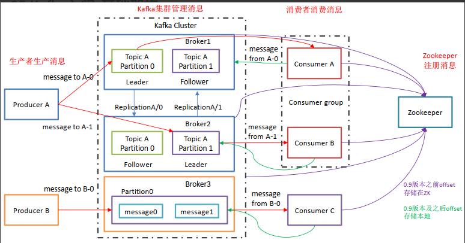
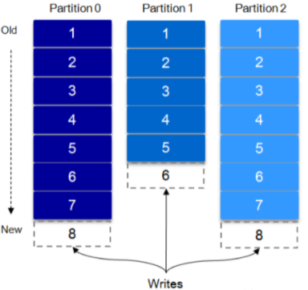
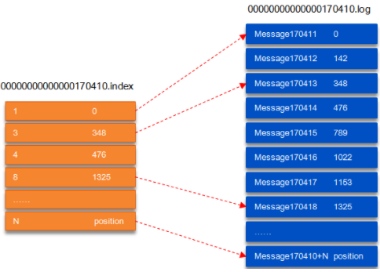
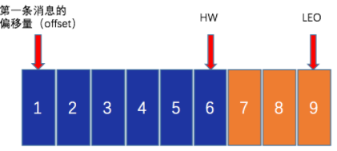
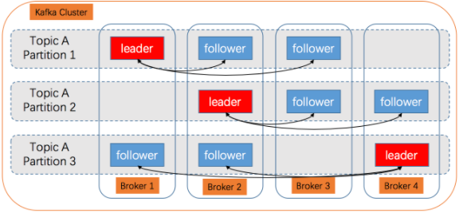
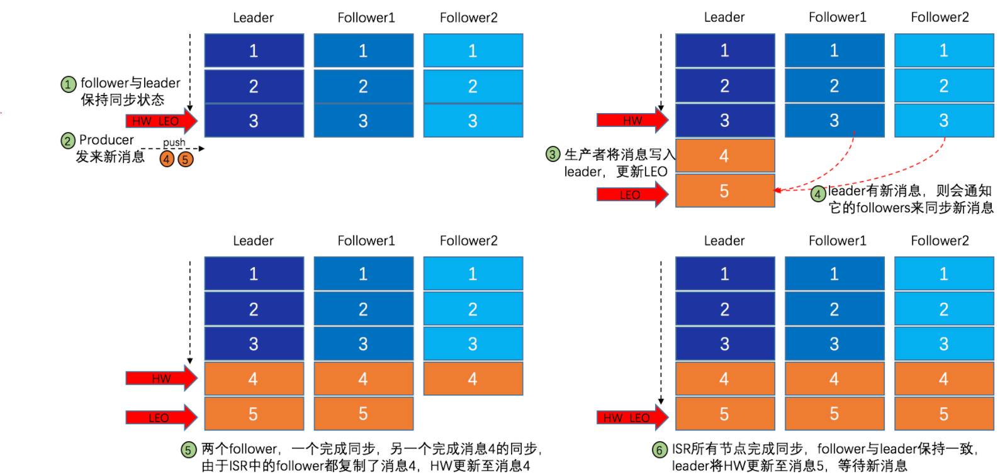
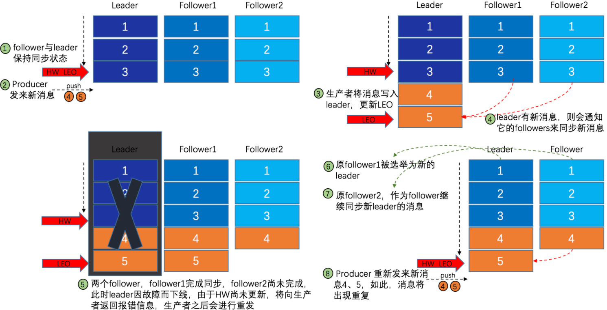
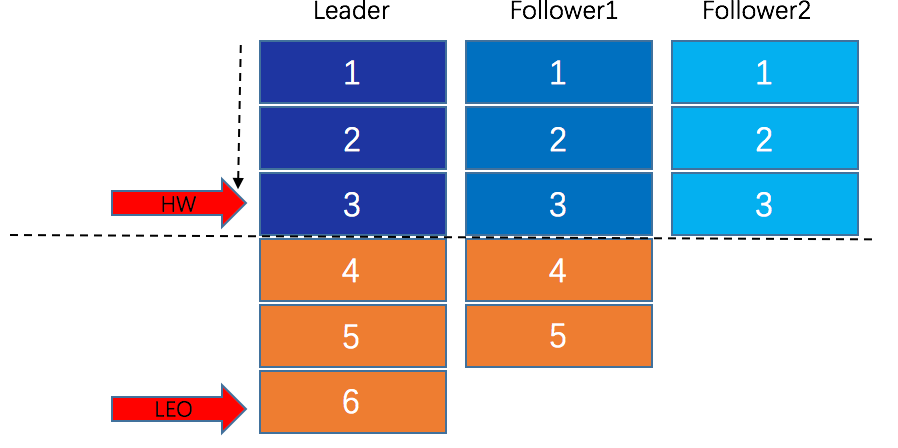

## 基础

Apache Kafka 是一个分布式**发布-订阅**消息系统。

消息持久化在磁盘中，并通过副本容灾。Kafka 基于 ZK 同步服务，而 RocketMQ 基于自己的组件 NameServer


### 消息传送机制

Kafka 支持3中消息投递语义，在业务中，常常食用 At least once 的模型

- At most once：最多一次，消息可能丢失，但不会重复
- At least once：最少一次，消息不会丢失，可能会重复
- Exactly once：只消费一次


### 基本架构



- Producer/Consumer：生产者发送消息，消费者接受并消费消息。
- Consumer Group：消费者组，由多个 Consumer 组成。high-level consumer API 中，每个 consumer 都属于一个 consumer-group，每条消息只能被 consumer group 中的一个 Consumer 消费，但可以被多个 consumer group 消费
- Broker：Kafka 集群中存储消息的组件成为一个 Kafka 实例，即 Broker
- **Topic**：消息的逻辑分组，Producer 发送消息时需要指定 Topic
- **Partition**：每个 Topic 对应多个分区，分区以文件的形式存储在 Broker 上， 既可以做副本容灾也可以负载均衡。
  - leader：某个 Topic 分区的主副本，负责处理消息发送和消费
  - follower：分区的从副本，实时从 Leader 中同步数据。Leader 宕机后从 Follower 中选举出新的 Leader
- controller：Kafka 集群中的其中一个服务器，用来进行 leader 选举和故障转移
- ZooKeeper：Kafka 通过 ZK 来存储集群的 meta 信息


#### Topic & Partition

Topic 可以认为是消息的逻辑分类。

Topic 可以被分成多个 partition，每个 partition 在存储层面是 append log 文件，任何发送到该 partition 的消息都会被追加到 log 文件的尾部。这是一种顺序写磁盘的机制，效率远高于随机写内存。



消息在分区文件中的位置称为 offset，offset 为一个 long 型数字，可以唯一标记一条消息。Kafka 未提供其他额外的索引机制存储 offset，文件只能顺序读写，无法随机读写。

#### Topic 分区原因

首先是结论：**负载均衡 + 水平扩展**

- Topic 是一个逻辑概念，如果不进行分区，全部存储在一个 broker中，那与该Topic 相关的消息读写受限于一个 broker 的吞吐量，不符合高吞吐量的应用场景。

- 引入 partition后，Kafka 将分区尽可能均匀地分布在不同的 broker 上，producer 发送消息时可以采用 **random**/**hash**/**轮询** 等算法选择目标 partition。多个 broker 可以极大地提高吞吐量，使系统具备良好的水平扩展能力。

partition 数量可以通过配置 num.partitions参数

partition 机制可以通过指定 producer 的 partition.class 参数指定（支持自定义）


### 高可靠性

副本机制是最常规、有效的策略。Kafka 实现高可靠也采用了该策略。

#### 文件存储机制

partition 事实上并不是最终的存储粒度，它还可以分为 segment。

broker 中配置 `log.dirs=/path/to/logs`可以设置 Kafka 消息文件存储目录。若只有一个 broker，创建了一个 topic 为 mytopic_test，partition 数量配置为4，消息文件目录下可以看到：

```bash
drwxr-xr-x 2 root root 4096 Apr 15 13:21 mytopic_test-0
drwxr-xr-x 2 root root 4096 Apr 15 13:21 mytopic_test-1
drwxr-xr-x 2 root root 4096 Apr 15 13:21 mytopic_test-2
drwxr-xr-x 2 root root 4096 Apr 15 13:21 mytopic_test-3
```

每个 partition 为一个目录，名为规则为 topic_name-seq_num。

##### segment

partition 全局的第一个 segment 从0开始，后续每个 segment 文件名为上一个 segment 文件最后一条消息的 offset 值，数值大小为64位，20为数字字符长度，0填充。

```shell
00000000000000000000.index
00000000000000000000.log
00000000000000170410.index
00000000000000170410.log
00000000000000239430.index
00000000000000239430.log
```



由两部分组成：

- index：元数据，指向对应 log 文件中 message 的物理偏移地址
- log： 消息文件


##### 通过 offset 查找消息

以上图为例，若要读取 offset=170418 的消息，首先二分查找 segment 文件

- 00000000000000000000.index
- 00000000000000170410.index（起始偏移为170411）
- 00000000000000239430.index（起始偏移为239431）
- ...

则目标消息落在第二文件中，随后根据 index 文件定位到 log 文件的1325偏移位置读取。

消息的物理结构是确定的，因此可以确定一条消息的大小，保证读取消息时不会多读。

offset（8 Bytes）、消息体的大小（4 Bytes）、crc32（4 Bytes）、magic（1 Byte）、attributes（1 Byte）、key length（4 Bytes）、key（K Bytes）、payload（N Bytes）等等

##### partition 为何无法作为存储单位

随着 producer 不断发送消息，必然引起 partition 文件无限扩大，此时维护消息的效率会受到影响。

通过 segment 进一步划分 partition，相当于大文件的处理被分配到多个大小类似的 segment 文件中，便于清理已消费的消息，提高磁盘利用率。

partition 只需要支持顺序读写，segment 的生命周期由服务器配置参数（log.segment.bytes, log.roll.{ms, hours}等）决定。

###  

#### 复制原理和同步方式

topic 的每个 partition 虽然实际上分为多个 segment 文件，但是对于上层应用来说，仍可以视 partition 为最小的存储单元。



- HW：HighWaterMark，指 consumer 能够看到的该 partition 的位置，与多副本机制有关。
- LEO：LogEndOffset，表示每个 partition 的最后一条消息的偏移位置。


Kafka 采用副本机制来提高消息的可靠性，复制因子（replica fator）决定了 partition 的副本数N。N个副本中有一个为 leader，其他为 follower。

- leader 负责处理该 partition 的所有读写请求
- follower 负责被动地复制 leader 的数据。



上图 Kafka 集群有4个 broker，某个 topic 上有3个partition，副本数为3


#### 同步副本队列 ISR

多个副本分布在不同的 broker 上，由于贷款、网络延迟等因素，同一时刻这些副本的状态往往不是一致的。

发生故障转移时，需要保证新 leader 的状态和原来的状态一致，Kafka 通过维护 ISR（In-Sync Replicas）列表，ISR 中的副本与原 leader 状态一致，因此从 ISR 中选举新的 leader 可以保证可靠性。


- AR：所有的副本统称为 Assigned Replicas，即 AR。ISR 是 AR 中的一个子集，由 leader 维护。

- OSR：follower 从 leader 中同步数据存在一定延迟（参数 replica.lag.time.max.ms 设置超时阈值），超过阈值的 follower 将会从 ISR 中移出，存入 OSR（Outof-Sync Replicas），新加入的 follower 也会先存入 OSR
- AR = ISR + OSR


上节提到的 HW 取值为 partition 对应的 ISR 中最小的 LEO，每个副本都有自己的 HW 并进行维护。

新消息写入后，consumer 不能立即消费，leader 会等待该消息被所有 ISR 中的副本同步后更新 HW，此时才能消费。这样就可以保证发生故障转移时新 leader 和原来的 leader HW 一致。

broker 内部的消息读取请求没有 HW 的限制。



- 由此可见，Kafka 的消息复制并非完全的同步复制，也不是异步复制
- ISR 在可靠性和吞吐量方法取得了一个良好的平衡


Kafka 的 ISR 由 ZK 节点进行维护，位置在

```bash
/brokers/topics/[topic]/partitions/[partition]/state
```

目前有两个组件会维护该节点：

- controller：某个 broker 会被选举为 controller，负责 partition 管理和副本状态管理。在符合某些特定条件下，Controller 下的 LeaderSelector 会选举新的 leader，ISR 和新的 `leader_epoch` 及 `controller_epoch` 写入 ZooKeeper 的相关节点中。同时发起 LeaderAndIsrRequest 通知所有的副本。
- leader：有单独的线程检测 ISR 中 follower 是否不再属于 ISR，如果 ISR 有变化，则会将 ISR 新状态返回 ZK。


#### 数据可靠性和持久性

request.required.acks 参数用于设置数据可靠性级别：

- 1：默认情况，producer 发送数据到 leader，leader 写本地日志成功，返回客户端成功；此时 ISR 中的其它副本还没有来得及拉取该消息，如果此时 leader 宕机了，那么此次发送的消息就会丢失。
- 0：producer 发送数据，无需 leader 返回成功消息。消息吞吐量最高，但可靠性最低，可能在发送过程中丢失数据，可能在 leader 宕机时丢失数据。
- -1：producer 发送数据给 leader，leader 收到数据后要等到 ISR 列表中的所有副本都同步数据完成后（强一致性），才向生产者返回成功消息，如果一直收不到成功消息，则认为发送数据失败会自动重发数据。这是可靠性最高的方案，当然，性能也会受到一定影响。

可靠性除了设置为-1外，还需要min.insync.replicas 配合，该参数只有在-1的情况下才生效，ISR 中的副本数必须要大于该参数设置的值。


#### HW 机制



如图 follower1 多出的消息5需要 HW 的协同配合保证不重复。



leader HW 是 ISR 中最小的那个 LEO，如上图，HW 为3。故障的副本节点恢复过来后，都需要从将 log 文件截断至 leader 的 HW 出，然后再重新同步消息。如果是 leader 故障，新选举出来的 leader 会让其他的 follower 截断至自己的 HW 位置然后再拉取新的消息。

#### Leader 选举

ISR 中 follower 能够保证和 leader 保持同步，只有 ISR 中所有 follower 都确认成功，一个消息才真正发送成功。ISR 的大小越大，可靠性越高，吞吐量越低。

##### 少数服从多数

场景的选举策略，但是 Kafka 并没有采用这种方式。这种策略要求一半以上的副本完成消息复制。

- 优点在于延迟取决于最快的几个节点
- 劣势在于为了保证 leader 选举的正常进行，它所能容忍的失败的 follower 数比较少，如果要容忍 1 个 follower 挂掉，那么至少要 3 个以上的副本，如果要容忍 2 个 follower 挂掉，必须要有 5 个以上的副本。也就是说，在生产环境下为了保证较高的容错率，必须要有大量的副本，而大量的副本又会在大数据量下导致性能的急剧下降。这种算法更多用在 ZooKeeper 这种共享集群配置的系统中，而很少在需要大量数据的系统中使用。


##### Kafka 选举策略

kafka 采用的选举算法更像是微软的 PacificA。

- Kafka 在 ZK 中为每个 partition 动态维护一个 ISR，ISR 中所有 follower 都完成同步消息才会被认为发送成功，而新的 leader 只能从 ISR 中选举。
- ISR 中副本数量通常无需超过总副本数的一般，可以自由设置，能够在可靠性和吞吐量之间取得平衡。

极端情况下，如某个 parititon 的所有 replica 都挂了，有以下两种解决方案

- 等待 ISR 中任意一个副本恢复，选举其作为 leader
- 选择第一个恢复的副本，默认策略（`unclean.leader.election.enable=true`）。


### ZooKeeper 的作用

ZK 在 Kafka 中的作用主要有：broker 注册，topic 注册、producer 和 consumer 负载均衡、维护 partition 和 consumer 关系、记录消息 offset、consumer 注册。

#### broker 注册

- ZK 目录下 `/brokers` 记录了 Kafka 集群的 broker 注册信息。
- broker 启动时，将自己的 broker.id 注册到 ZK 中，broker.id 具有全局唯一性。节点路径为`/brokers/ids/{broker.id}`
- 节点中还会存储 broker 的 broker.name 和端口号
- broker 节点为临时节点，当其失效时，ZK 会删除。


#### Topic 注册

topic 和 broker 的对应关系由 ZK 维护，ZK 中有专门的节点记录，路径为`/brokers/topics/{topic_name}`。

topic 的 partition 存在副本机制保证可靠性，而数据一致性是通过 ZK 实现的 leader/follower 完成的：

- producer 写入消息，leader 先写入消息，然后同步给其他 follower
- 故障转移


#### Consumer 注册

ZK 下有关 consumer group 的节点路径为 `/consumers/{group_id}`，其下有三个子结点：

- ids：记录该消费者组当前正在消费的 consumer
- owners：记录该消费者组消费的 topic 信息
- offsets：记录每个 topic 的每个 partition 的 offset


新消费者注册到 Kafka 时， 会在`/consumers/{group_id}/ids`节点下创建临时节点，记录相关信息。

每个消费者都要关注其所属消费者组中消费者数目的变化，即监听 `/consumers/{group_id}/ids` 下子节点的变化。一单发现消费者新增或减少，就会触发消费者的负载均衡。


#### 负载均衡

##### producer

Kafka 会基于 ZK 将 topic 的不同 partition 分散到不同的 broker上。

producer 启动后在 ZK 下注册，并创建一个临时节点监听 broker 服务器列表的裱花。由于在 ZK 下 broker 创建的也是临时节点，当 broker 发生变化时，producer 可以通过监听得到通知，从而改变自己的 broker list。

发送消息时必须制定 topic，但是对于 partition，有两种制定方式：

- 明确制定 partition（0-N）：消息被发送到指定 partition
- 设置为 `RD_KAFKA_PARTITION_UA`，则 Kafka 会回调 partitioner 进行均衡选取，partitioner 可以自定义，默认采用随机选择方法。

##### Consumer

Kafka 保证同一个消费者组中只有一个 consumer 可消费某条消息，实际上， Kafka 保证的是稳定状态下每一个 consumer 实例只会消费某一个或多个特定的数据，而某个 partition 的数据只会被某一个特定的 consumer 实例所消费。

- 劣势：无法使同一个消费组中的 consumer 均匀消费数据
- 优势：每个 consumer 不用都跟大量的 broker 通信，减少通信开销，降低分配难度。


consumer 数量

- 当消费者组中 consumer 数量少于 partition 数量时，则至少由一个 consumer 消费多个 partition
- 相同，每个 consumer 消费一个 partition
- 多余，会有部分 consumer 无法消费该 topic 下消息


- consumer 启动时在 ZK 下创建节点`/consumer/[group-id]/ids/[conusmer-id]`，并监听`/consumer/[group-id]/ids`，某一个 consumer 变化时，同组的会得到通知。
- consumer 还监听 broker 列表的变化，Kafka 根据 消费者列表和 partition 列表，轮流地将 partition 分配给 consumer。


#### Offset

ZK 中还需要记录 partition 中消息的消费进度 offset，作用有：

- consumer 重启后能够从上次消费的地方开始
- consumer 故障转移后，新 consumer 能够从之前的进度开始消费

offset 节点路径为`/consumers/[group_id]/offsets/[topic]/[broker_id-partition_id]`

Kafka 推荐将 consumer 的 offset 信息存储在内部 topic 中：

`__consumer_offsets(/brokers/topics/__consumer_offsets)`

offset 默认存储在 broker，也可以存储在本地文件。


#### Partition 与 Consumer 的关系

之前提到每个 partition 只能被同组的一个 consumer 消费，因此 ZK 需要记录下他俩的对应关系。

一个 consumer 一旦确定了对一个 partition 的消费全力，需要将其 consumer id 写入 ZK 对应消息分区的临时节点上：

`/consumers/[group_id]/owners/[topic]/[broker_id-partition_id]`

`[broker_id-partition_id]`就是消息分区的标识，节点内容为与其绑定的 consumer id。


### Kafka 工作流程

#### producer 发布消息

producer 采用 push 模型将消息发布到 broker，每条消息以 append 的方式顺序添加到 partition 中。

分区选择机制：

- 指定了 partition，直接使用
- 未指定 partition 但指定了 key，对 key 进行哈希选出一个 partition
- 都未指定，轮询


写入流程：

1. producer 先从 ZooKeeper 的 `/brokers/.../state` 节点找到该 partition 的leader；
2. producer 将消息发送给该 leader；
3. leader 将消息写入本地 log；
4. followers 从 leader pull 消息，写入本地 log 后 leader 发送 ACK；
5. leader 收到所有 ISR 中的 replica 的 ACK 后，增加 HW（high watermark，最后 commit 的 offset） 并向 producer 发送 ACK；


#### Broker 存储消息

物理上把 topic 分成一个或多个 patition，每个 patition 物理上对应一个文件夹（该文件夹存储该 patition 的所有消息和索引文件）


#### Consumer 消费消息

consumer 采用 pull 模式从 broker 中拉取消息

1. 如果消费线程大于 patition 数量，则有些线程将收不到消息；
2. 如果 patition 数量大于消费线程数，则有些线程多收到多个 patition 的消息；如果一个线程消费多个 patition，则无法保证收到的消息的顺序，而一个 patition 内的消息是有序的。
