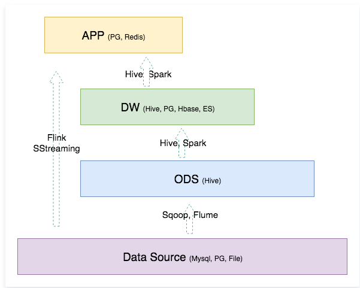

# 数据仓库

## 数据仓库的建模方法

通过数据建模更好地组织、存储数据，以便在性能、成本、效率和数据质量之间找到最佳平衡点。考虑一下因素：

访问性能：能够快速查询所需的数据，减少数据I/O
数据成本：减少不必要的数据冗余，实现计算结果数据复用，降低大数 据系统中的存储成本和计算成本 
使用效率：改善用户应用体验，提高使用数据的效率
数据质量：改善数据统计口径的不一致性，减少数据计算错误 的可能性，提供高质量的、一致的数据访问平台

### 范式建模

ER模型

第三范式：属性不可分，非主属性只依赖于键码，不存在函数传递依赖

### 维度建模

- 维度表：分析数据表的角度，主要是聚合的列
- 事实表：事实表中主要存储了用于计算指标的度量属性，还有维度表中的外键

#### 星型模型

以事实表为中心，维度表通过外键关联在事实表上.

#### 雪花模型

维度表上可以关联其他维度表，维护成本高，性能较差。多一层关联意味着多一次join操作

- 雪花模型的维度表一般符合 3NF，冗余较少。星型模型利用冗余避免复杂性

#### 星座模型

对星型模型的扩展，多张事实表共享维度表。

## 数据仓库分层

数据仓库分层可以使得数据体系更容易理解和使用，明确表之间的依赖和层次关系，避免出现混乱的情况

- 清晰数据结构：每一个数据分层都有它的作用域和职责，在使用表的时候能更方便地定位和理解
- 减少重复开发：规范数据分层，开发一些通用的中间层数据，能够减少极大的重复计算
- 统一数据口径：通过数据分层，提供统一的数据出口，统一对外输出的数据口径
- 复杂问题简单化：将一个复杂的任务分解成多个步骤来完成，每一层解决特定的问题

### 分层设计

- 数据运营层（ODS）：原始数据
- 数据仓库层（DW）：中间层数据
- 数据应用层（APP）：面向业务定制的应用数据

#### ODS（Operational Data Store）

最接近数据源中数据的一层，业务数据库中数据源经过ETL装入本层。不会做太多的数据清洗工作，数据的去噪、去重、异常值处理等过程可以放在后面的DWD层来做。

#### DW（Data WareHouse）

从 ODS 层中获取的数据按照主题建立各种数据模型。

##### DWD（Detail）

数据明细层，保持和 ODS 一样的数据粒度，提供一定的数据质量保证

- 减少一些维度，减少事实表和维度表的关联
- 汇集一部分相同主题的表

##### DWM（Middle）

数据中间层，聚合

- 在 DWD 的基础上对数据做轻度的聚合操作，生成一系列中间表，提升公共指标的复用性
- 对通用的核心维度聚合，计算一些统计指标（CNT、SUM）

##### DWS（Service）

数据服务层，数据集市、宽表。

- 按照业务生成宽表，提供 OLAP 查询能力
- 直接计算 DWD 或者 ODS 的聚合会存在计算量太大并且维度太少的问题。利用 DWM 的中间表拼接处一张宽表

#### APP

应用层，提供给数据产品和数据分析使用的数据。一般存放在 MySQL、ES、Redis 等中间件系统中。

