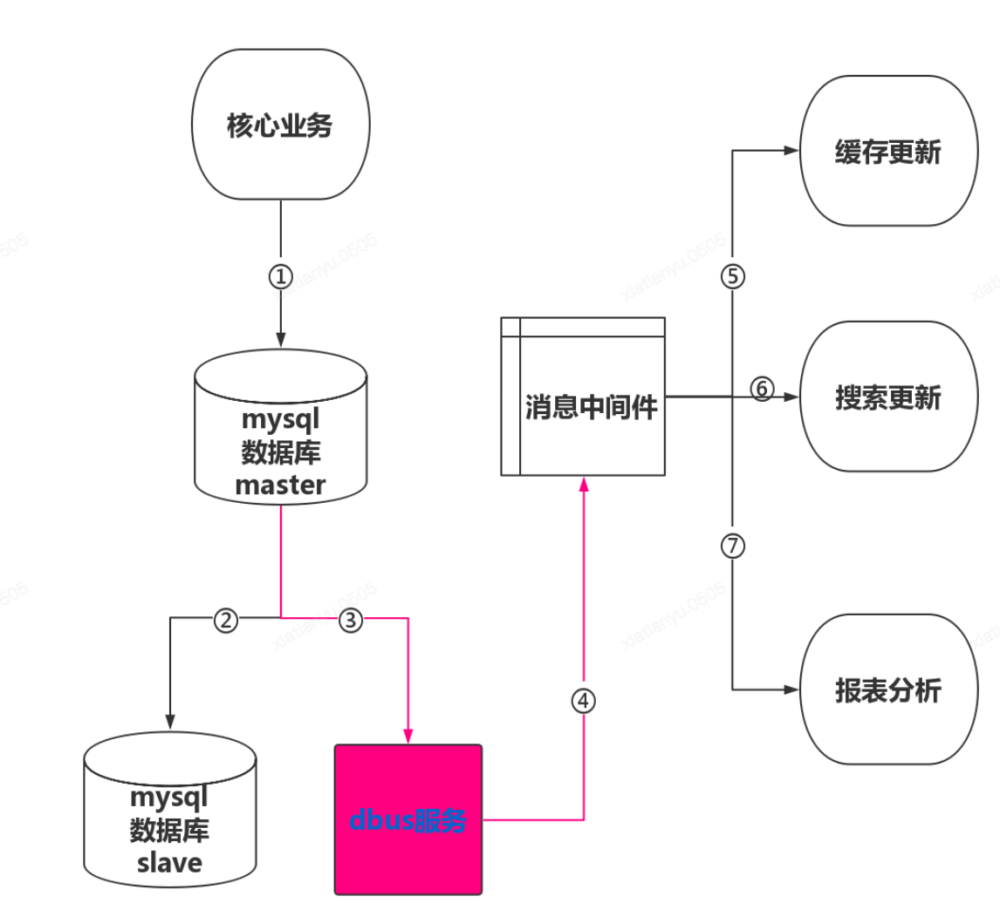

## 业务需求

## 主数据优化

### 服务限流

QPS 达到300-400开始出现错误。

限流方法采用基于 Redis 的分布式限流器。借助 Redis 存储管理 Token，获取失败或者 QPS 超限则拒绝请求

基本原理和 RRateLimiter 一致。

### 模糊匹配查询使用 ES

## 主数据中间件

#### Redis

1. 网关鉴权每次需要查询三次 MySQL，添加缓存加快查询
2. 分布式锁
3. RRateLimiter 限流

#### RocketMQ

1. Consumer：
   1. 拉取下游系统（mdmV2/资金/采购）消息，更新 ES 索引（backend）
   2. 拉取 dbus 产生的消息（mysqlbinlog），封装消息为 Lark 通知和 MQ 消息，作为 Producer 准备发送这些消息。
2. Producer：交易方/楼层/法人主体等变更，发送消息通知上游，其中法人主体会额外发送到一个 Topic 中

#### Kafka

#### ElasticSearch

1. 字符串模糊匹配采用 ES 处理，先查询 ES 得到主键 id，再根据主键 id 查询 MySQL 或者 Redis