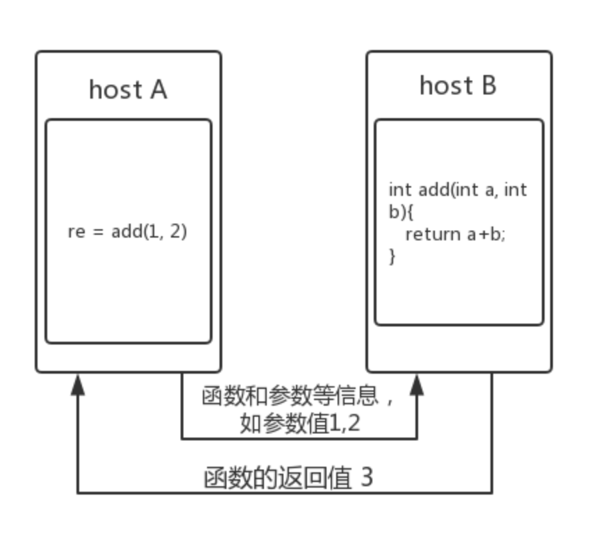
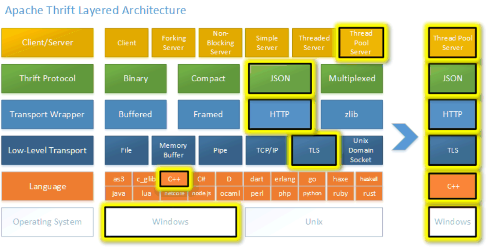
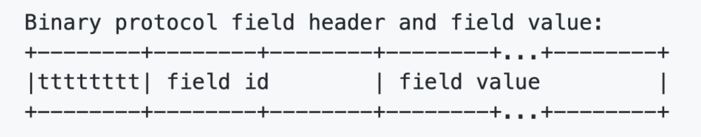
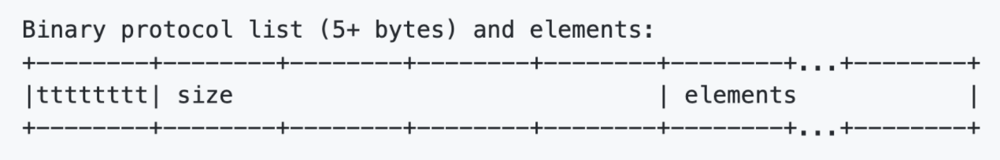
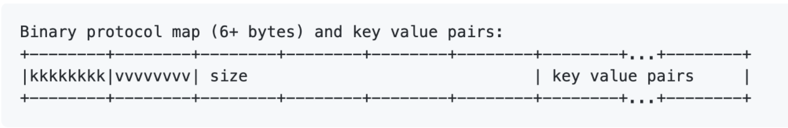

# RPC 概念

远程过程调用 （RPC）核心要解决的问题是如何调用另一个主机上的方法，就像在本地调用一样。如下图



那么需要考虑的问题有两个：

1. 序列化和反序列化。请求端将对象序列化成二进制序列，服务端将二进制序列反序列化成对象，保证两方都能正确处理和发送数据。
2. 网络传输。RPC 需要可靠传输，因此一般建立在 TCP 之上的。


## Thrift RPC

### Thrift 简介

Thrift 是一套包含序列化功能和支持服务通信的 RPC 框架，主要包含三大部分:**代码生成**、**序列化框架**、**RPC框架**，大致相当于protoc + protobuffer + gRPC，并且支持大量语言，保证常用功能在跨语言间功能一致。

#### 特点

- 基于二进制的高性能序列化和反序列化框架
- 基于 NIO 的网络通信
- 相对简单的服务调用模型
- 使用 IDL 支持跨语言调用

#### 架构



thrift 的网络层次

```bash
  +-------------------------------------------+
  | Server                                    |
  | (single-threaded, event-driven etc)       |
  +-------------------------------------------+
  | Processor                                 |
  | (compiler generated)                      |
  +-------------------------------------------+
  | Protocol                                  |
  | (JSON, compact etc)                       |
  +-------------------------------------------+
  | Transport                                 |
  | (raw TCP, HTTP etc)                       |
  +-------------------------------------------+
```

- Transport：传输层提供网络 IO 读写的抽象接口，将底层 IO 读写和 Thrfit 其他组件解耦。

Transport 提供以下接口：

```
open
close
read
write
flush
```

对于 Server 端，还提供了 ServerTransport 接口用于监听和接收客户端的请求

```
open
listen
accept
close
```


- Protocol：

Procotol 定义 Message 和 Struct 的编码格式，实现序列化和反序列化。主要提供的协议有 binary/comact/json。

流式处理，无需消息被完整接收就能开始解码，减少了消息处理的时延。


- Processor：

Processor 从 protocol 中读取方法名和参数，调用 Server 上的实现，将结果写到 protocol。封装了读取输入流、写入输出流的能力。


### IDL 和代码生成

Thrift 采用IDL（Interface Definition Language）来定义通用的服务接口，然后通过Thrift提供的编译器，可以将服务接口编译成不同语言编写的代码，通过这个方式来实现跨语言的功能。

### Thrift 序列化

Thrift 序列化协议主要有 binary/compact/json。下面主要介绍 binary 和 compact。二进制编码通常使用 TLV 编码实现，即 Tag，Length，Value组成的结构体，几乎可以描述任意数据类型。TLV 的 Value 也可以是 TLV，这种嵌套的特性可以用来包装协议的实现。bianry 和 compact 都是用 TLV 变种实现的，两者不同在于对整数类型的处理。

#### binary 序列化

##### 简单数据类型为定长编码：类型标识+编号+数据值



| 简单数据类型 |               |                |                                   |
| ------------ | ------------- | -------------- | --------------------------------- |
| 数据类型     | 类型标识(8位) | field_id(16位) | field_value                       |
| bool         | 2             |                | 一个字节的值（true：1，false：0） |
| byte         | 3             |                | 一个字节值                        |
| double       | 4             |                | 八个字节值                        |
| i16          | 6             |                | 两个字节值                        |
| i32          | 8             |                | 四个字节值                        |
| i64          | 10            |                | 八个字节值                        |

##### 复合数据类型

复合数据类型的 field_value 不同：

list 和 set：类型标识（8）+成员个数（32）+成员值



map：k类型（8）+v类型（8）+成员个数（32）+kv值



| 复合数据类型 |                 |                  |                                           |
| ------------ | --------------- | ---------------- | ----------------------------------------- |
| 数据类型     | 类型标识（8位） | field_id（16位） | field_value                               |
| string       | 11              |                  | size(32) + field_value                    |
| struct       | 12              |                  | 嵌套数据+一个字节停止符（0）              |
| map          | 13              |                  | k类型（8）+v类型（8）+成员个数（32）+kv值 |
| set          | 14              |                  | 类型标识（8）+成员个数（32）+成员值       |
| list         | 15              |                  | 类型标识（8）+成员个数（32）+成员值       |

#### 

#### compact 序列化

compact 序列化方式不同于 binary 的地方在于整数类型采用 zigzag 和 varint 压缩编码实现。

1. varint 编码：不定长无符号整数编码，每个字节按低位到高位，我们只使用低7位，最高的一位作为一个标志位（msb）

   - 1：下一个字节也是该数字的一部分
   - 0：下一个字节不是该数字的一部分

   因此小数字占有字节更少，大数字占有字节更多，但大部分序列化的数字都是小数字，所以整体压缩效果明显。比如300(i32)，Binary序列化下需要4个字节，采用varint编码只需要两个字节：**1**010 1100 **0**000 0010。

2. zigzag 编码：varint 解决了无符号编码问题，假设有符号数也直接采用varint编码，因为负数最高位是1，比如i32就都会使用5个字节了，反而使用更多字节，为了解决有符号负数问题，先采用 zigzag 编码将有符号数映射到无符号数上。

   ```bash
   以i32为例,设n为i32值原始值，m为映射无符号值
   
   1) if n >= 0, m=2*n
   
   2) if n < 0, m=2*|n| - 1
   
   3) 采用位运算实现: m=(n << 1) ^ (n >> 31)
   ```

compact 序列化和 binary 基本一致，只是在 i16，i32，i64 三种类型使用 zigzga + varint 编码实现，复合类型的长度只用 varint 编码。


#### 可改进的地方

- 类型+编号就占了 3 个字节，大部分数据就是几个字节
- 除了整形数据，其他数据是否能够压缩

1. Thrift 官方没有给出解决方案，grpc 的序列化框架 Protobuf 将类型和编号合并了
2. Thrift 官方提供了 ZlibTransport 在传输层进行压缩。也可以在业务层对大结构体的数据实现类似 snappy/lz4 等压缩。