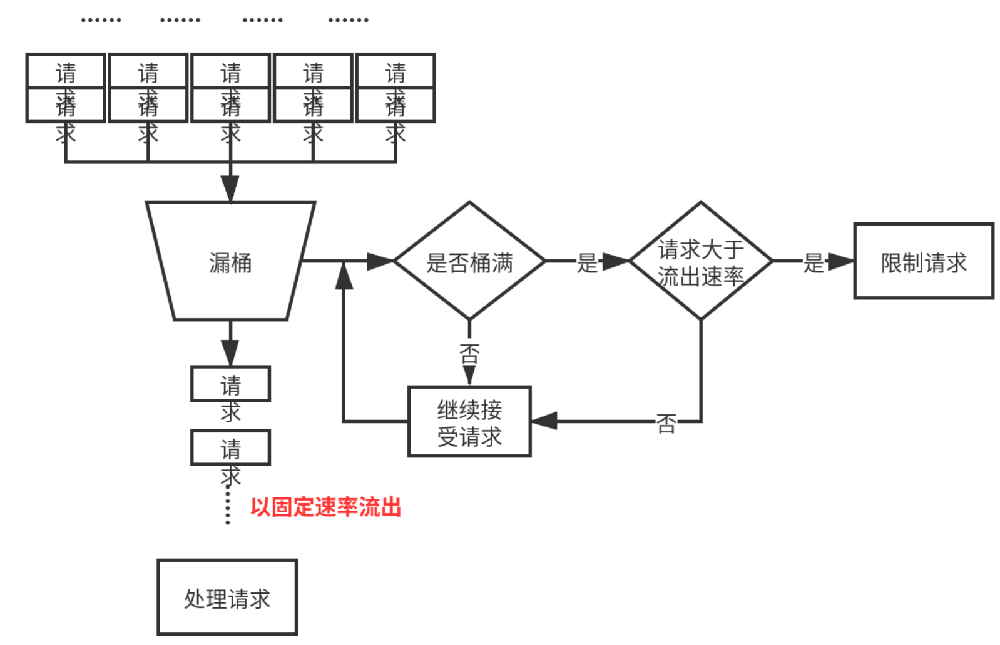
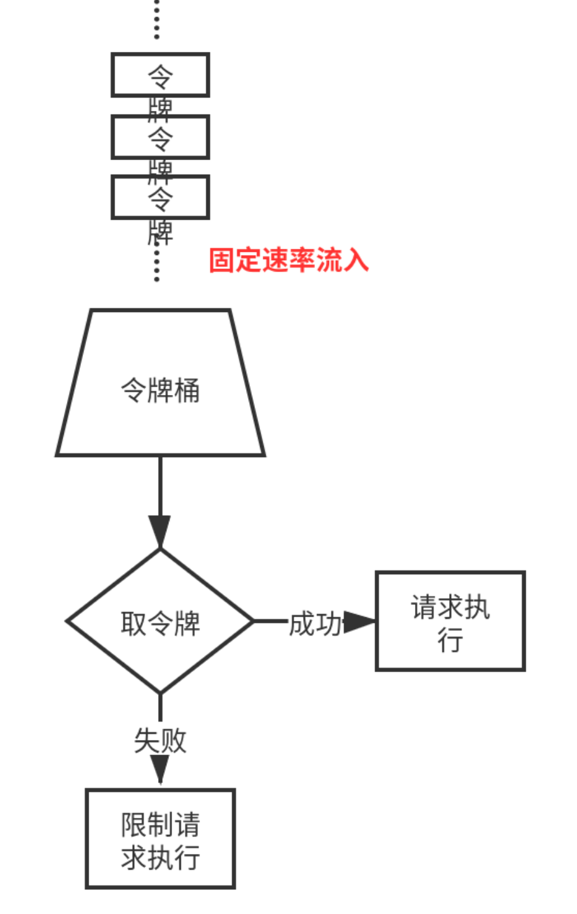

# 微服务

## 微服务优势

### 单体架构

传统单体应用将所有功能的表示层、业务层、数据访问层，包括静态资源等全部都放在一个工程中，编译打包部署到单个服务器上，在项目规模比较小的情况下比较合适。

但当应用业务越来越复杂，会出现以下一些问题：

- 各功能耦合度高，可维护性，可扩展性较差。
- 测试难度大。
- 单体应用并发能力有限。
- 容错率较低，服务器宕机或者应用某个模块出错，整个项目就无法提供服务了。

### 微服务

将应用按照某块功能划分为一个一个相互独立的微服务，每个微服务部署在不同的容器上。应用通过服务描述方式获取到相应的微服务，通常为 RESTful API 基于 HTTP。

优势在于：

- 每个独立的服务内聚性高，各服务之间耦合度低，有良好的扩展性和复用性。
- 服务之间采用 HTTP 通信，也可以采用消息队列进行通信。
- 微服务通常部署在容器中，容器技术使得微服务的管理变得方便。

微服务同样存在一些缺陷：

- 微服务项目构建复杂度远高于单体应用。
- 分布式系统中难以保证数据一致性。
- 服务部署比单体应用更加复杂。

### 微服务中的限流、熔断和降级

#### 限流

##### 限流原因

对外 API 服务：

API 服务往往会因为某些情况如用户增长过快/某个热点事件/恶意访问导致流量激增，多达原来的10倍或20倍，如果真遇到这种情况弹性扩容是来不及的。

对内 RPC 服务：

一个服务 A 的接口可能被 BCDE 多个服务进行调用，在 B 服务发生突发流量时，直接把A服务给调用挂了，导致A服务对 CDE 也无法提供服务。
1、每个调用方采用线程池进行资源隔离
2、使用限流手段对每个调用方进行限流

##### 限流算法

常见算法：计数器、漏通、令牌桶

**计数器**：计数器在一定时间范围内如1秒钟，限流 QPS 为某个值如100。每来一个请求就计数器就+1，1秒钟内到达100后拒绝后续全部请求，1秒后计数器清零。

弊端：

- 瞬时流量问题：在0.9秒和1.1秒之间都有100个请求，那么间隔0.2秒内仍然处理了200个请求，违背了限流初衷。
- 突刺现象：在前0.1秒处理了100个请求，后续只能拒绝接下来的请求，不平滑，空闲期间服务器资源被浪费。

**漏桶**：请求进入到漏桶中，漏桶以固定的速度流出，当访问频率超过接口响应频率流速过大时拒绝请求，可以看到漏桶相当于一个队列，进队的速率不受限制，出队是固定速率。漏桶算法解决了突刺现象，只要请求不被拒绝就会被处理。

弊端：无法处理瞬时流量问题。

**令牌桶**：用令牌 token 来衡量服务器的处理能力。固定的速率向桶中放入令牌直至桶满，在执行请求前需要先从桶中获取令牌，形式上也相当于队列，入队以固定速率，出对不受限制，这点与漏桶刚好相反。

#### 熔断和降级

##### 熔断

微服务之间相互调用，如果调用链路上某个微服务的调用响应时间过长或者不可用，对最开始的微服务的调用就会占用越来越多的系统资源，进而引起系统崩溃，所谓的“雪崩效应”。

熔断机制是应对雪崩效应的一种微服务链路保护机制。服务熔断的作用类似于我们家用的保险丝，当某服务出现不可用或响应超时的情况时，为了防止整个系统出现雪崩，暂时停止对该服务的调用。

- 当调用的微服务不可用是，能够快速失败
- 快速失败后，能够根据一定的算法动态试探所依赖对象是否恢复

##### 降级

服务降级是从整个系统的负荷情况出发和考虑的，对某些负荷会比较高的情况，为了预防某些功能（业务场景）出现负荷过载或者响应慢的情况。

在其内部暂时舍弃对一些非核心的接口和数据的请求，而直接返回一个提前准备好的fallback（退路）错误处理信息。这样，虽然提供的是一个有损的服务，但却保证了整个系统的稳定性和可用性。

例如：当双11活动时，把无关交易的服务统统降级，如查看蚂蚁深林，查看历史订单，商品历史评论，只显示最后100条等等。

##### 熔断和降级的比较

相同：

- 都是保证系统可用性和可靠性的手段
- 最终业务反馈类似，用户体验到的都是某些功能不可用或不可达
- 粒度一般都是服务级别，当然，业界也有不少更细粒度的做法，比如做到数据持久层（允许查询，不允许增删改）
- 自治性要求很高，熔断模式一般都是服务基于策略的自动触发，降级虽说可人工干预，但在微服务架构下，完全靠人显然不可能，开关预置、配置中心都是必要手段；

区别：

- 触发原因：熔断是某个服务不可用，而降级一般从整体符合考虑
- 管理目标的层次：熔断其实是一个框架级的处理，每个微服务都需要；而降级一般需要对业务有层级之分（比如降级一般是从最外围服务开始）
- 实现方式：服务降级具有代码侵入性(由控制器完成/或自动降级)，熔断一般称为自我熔断

##### 主流框架

- Sentinel
- Hystrix
- Resilience4j

